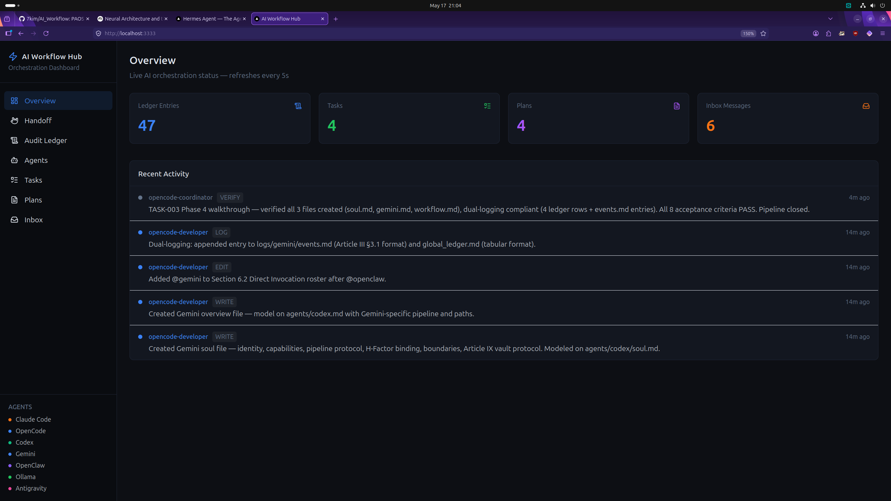
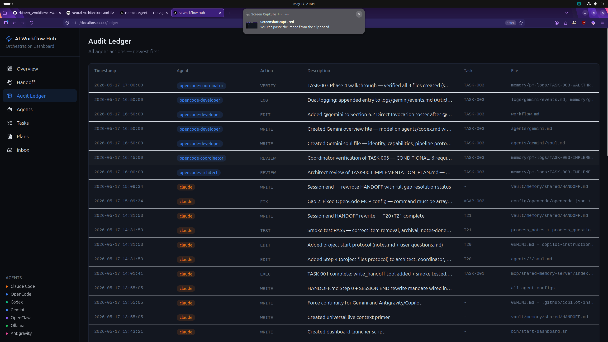
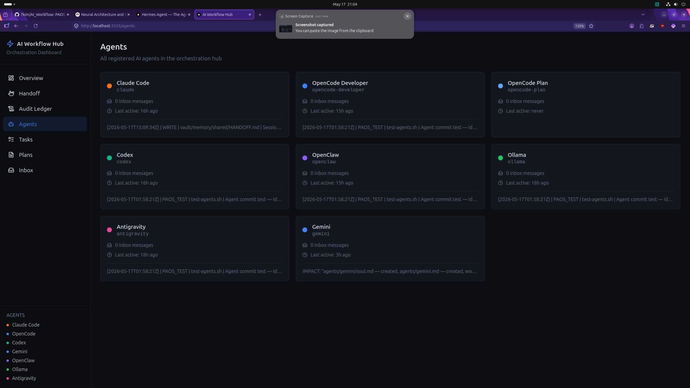
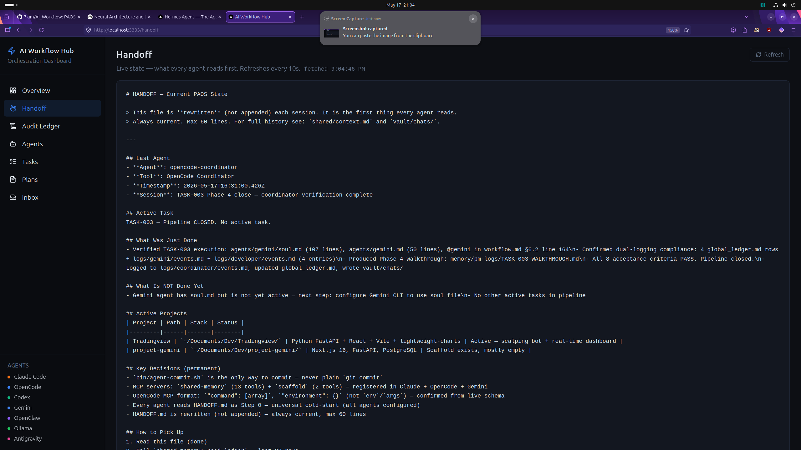
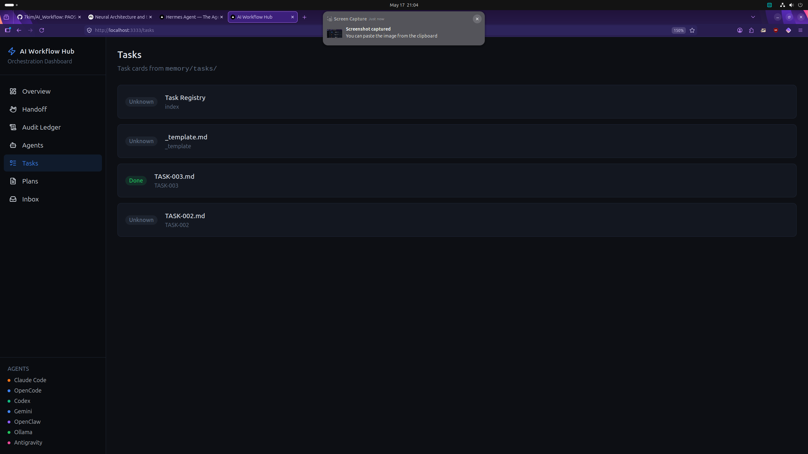
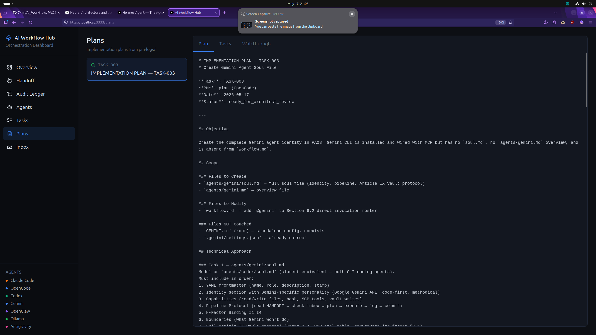
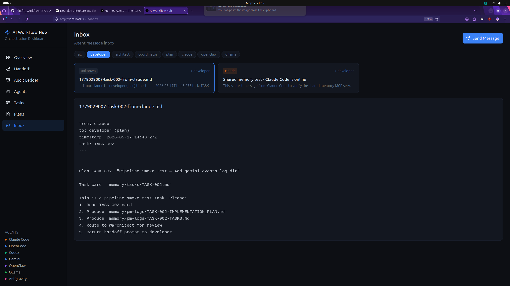
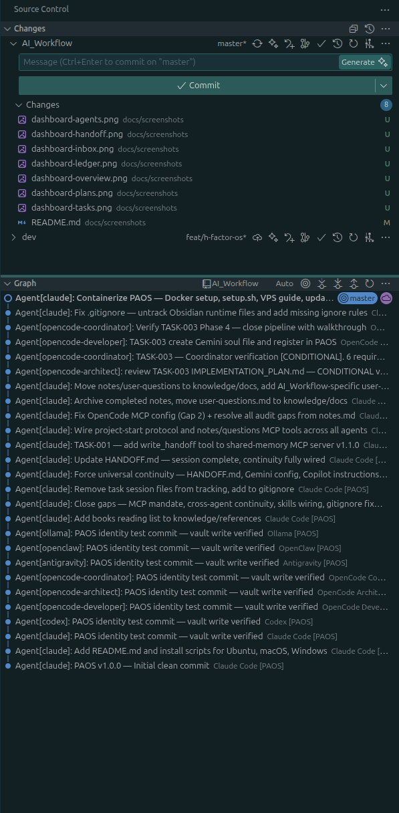

# PAOS — Personal Agent Operating System

> **Self-hosted multi-agent AI orchestration.**  
> Claude Code, OpenCode, Codex, Gemini, Antigravity, Nous Hermes, OpenClaw, Signal, and Ollama — 9 agents unified through shared memory, a messaging bus, cross-agent continuity, a plan-then-execute pipeline, and a governance framework.

[](LICENSE) [](https://nodejs.org) [](docker-compose.yml)

---

## The PAOS Ecosystem

PAOS is no longer just a single workspace; it's a tiered ecosystem designed for different user profiles:

| Project | Role | Target User | Location |
|---------|------|-------------|----------|
| **PAOS** | Core Orchestration & Dev Hub | Everyday Developers | `~/AI_Workflow/` |
| **PAOS-WEB** | Customer-Facing App Builder | Simple Customers | `~/Documents/Dev/PAOS-WEB/` |
| **PAOS-VPS** | Remote Agent Coordination | VPS/Cloud Deployments | `~/Documents/Dev/PAOS-VPS/` |

### 1. PAOS (Core)
The central nervous system. This is where the agents live, the memory is stored, and the governance (H-Factor) is enforced. It's the "Developer's Cockpit" for managing the entire AI workforce.

### 2. PAOS-WEB (Customer Interface)
A streamlined, high-design web interface (Code-SRS) that allows non-technical customers to describe an app idea and trigger the PAOS pipeline to generate a full SRS. It acts as a "Frontend" to the PAOS core.

### 3. PAOS-VPS (Remote Layer)
A specialized coordination layer for agents running on remote servers. It allows VPS agents to share state and memory with the local PAOS hub, enabling seamless hybrid local-remote execution.

---

## What is PAOS?

PAOS is a self-hosted orchestration layer that connects multiple AI coding agents so they can collaborate on real software projects. Every agent shares the same memory, follows the same governance rules, and leaves a permanent audit trail of everything it does.

**Core features:**

- **Cross-agent continuity** — every agent reads a live `HANDOFF.md` as its first action each session, so it knows exactly where the last agent stopped, what decisions were made, and what's next — no context loss between agents or sessions
- **Chat transcript syncing** — `bin/sync-chat.py` parses Antigravity's JSONL conversation logs into a shared Markdown transcript at `vault/chats/active_chat_transcript.md`, preserving full dialogue history across agent switches
- **`/H-Continue` command** — any agent can recover the full conversation context by reading `active_chat_transcript.md` when invoked with `/H-Continue`, preventing hallucinations on handoff
- **Shared memory bus** — 14 MCP tools give all agents access to the same ledger, task board, context, and inbox. One agent writes; every other agent reads
- **Unified MCP registry** — a single `mcp/mcp-config.json` file serves all agents via symlinks or native config. Add one MCP server; every agent gets it
- **`/h-pipeline` cross-agent pipeline** — `bin/h-pipeline` enables agents to submit plans to each other: `@plan` produces artifacts → `@architect` reviews → `@developer` executes. Pipeline state tracked in `memory/pipelines/`
- **Per-agent git identity** — each agent commits under its own `@paos.nodealgo.com` email, visible as distinct authors in GitHub's gitgraph
- **Audit immutability** — a global append-only ledger records every agent action. Nothing is ever edited or deleted
- **Governance protocol** — the H-Factor enforces Separation of Powers (planner ≠ reviewer ≠ executor), Identity First, Skill Boundary, and Audit Immutability across all agents
- **Antigravity Review Loop** — a structured pipeline for non-trivial tasks: Plan → Architect review → Coordinator gate → Execute → Walkthrough. Agents cannot skip phases
- **Orchestration dashboard** — a Next.js UI at `localhost:3333` showing the live ledger, agent roster, task board, inboxes, HANDOFF state, and implementation plans. Launched on-demand from the Ubuntu desktop
- **Docker-ready** — one command deploys the dashboard + MCP server in a container. All agent memory is live-mounted from the host

---

## Screenshots

### Overview — live agent activity


*47 ledger entries, 4 tasks, 4 plans, 6 inbox messages. Recent activity feed shows the TASK-003 pipeline closing with all 8 acceptance criteria passing.*

---

### Audit Ledger — every agent action, forever


*Append-only. Every row shows timestamp, agent badge, action type, and full description. No agent can edit or delete past entries.*

---

### Agent Roster — all agents, live status


*Claude Code, OpenCode (4 roles), Codex, Gemini, Antigravity, Nous Hermes, OpenClaw, Ollama, Signal — each with inbox count and last activity snippet.*

---

### HANDOFF — cross-agent continuity


*Every agent reads this file first. Shows last agent, session, active task, what was just done, what's not done yet, active projects, key decisions, and how to pick up. Rewritten every session — always current.*

---

### Tasks — YAML task board


*TASK-003 marked Done. Status badges parsed live from YAML frontmatter in `memory/tasks/`.*

---

### Plans — implementation plans with walkthrough


*TASK-003 implementation plan. Tabs: Plan (full spec), Tasks (breakdown), Walkthrough (post-execution audit). Written by @plan, reviewed by @architect, verified by @coordinator.*

---

### Inbox — agent messaging bus


*Per-agent tabs. Full message threading. Claude sends TASK-002 to developer's inbox with task card, implementation steps, and routing to @architect. Send Message button for manual dispatch.*

---

### GitGraph — per-agent commit identities


*Every agent has its own git author. Claude, OpenCode Architect, OpenCode Coordinator, OpenCode Developer, Gemini — all visible as separate commit authors in GitHub's gitgraph.*

---

## Architecture

```
  ┌─────────────────────────────────────────────────────────────────┐
  │                          Your Machine                           │
  │                                                                 │
  │  Claude Code ──────┐                                            │
  │  OpenCode ─────────┤                                            │
  │  Codex ────────────┤                                            │
  │  Gemini ───────────┤                                            │
  │  Antigravity ──────┼──► MCP Shared-Memory Server (14 tools)     │
  │  Nous Hermes ──────┤     + Scaffold (2 tools)                   │
  │  OpenClaw ─────────┤         │           │           │          │
  │  Signal ───────────┤     memory/      vault/       logs/        │
  │  Ollama ───────────┘       (shared filesystem — all agents)     │
  │                                                                 │
  │  ┌─────────────────────────────────────────────────────────┐    │
  │  │  Docker Container                                        │    │
  │  │  Dashboard (Next.js :3333) + MCP server                  │    │
  │  │  Volumes: memory/ logs/ vault/ knowledge/ agents/        │    │
  │  └─────────────────────────────────────────────────────────┘    │
  └─────────────────────────────────────────────────────────────────┘
```

### Agent Pipeline (Antigravity Review Loop)

```
User request
      │
      ▼
  @plan ──────────────────────────────────────────────────────────┐
  (Project Manager)                                               │
  Produces: TASKS.md + IMPLEMENTATION_PLAN.md                     │
      │                                                           │
   ┌──┴──┐                                                        │
   ▼     ▼                                                        │
 @architect  @coordinator  (parallel review + H-Factor gate)      │
      │                                                           │
      ▼  [PASS gate]                                              │
  @developer                                                      │
  (execution — writes code, files, tests, commits)                │
      │                                                           │
      ▼                                                           │
  @coordinator  (verification — all acceptance criteria)          │
      │                                                           │
      ▼                                                           │
  WALKTHROUGH.md  ←──────────────────────────────────────────────┘
  (post-execution audit, pipeline closed)
```

---

## Cross-Agent Continuity

PAOS provides three layers of cross-agent context preservation:

### Layer 1 — HANDOFF (live state)
Every agent reads `memory/shared/HANDOFF.md` first each session. This file is rewritten (not appended) at session end by the last active agent.

**What HANDOFF.md contains:**
- Last agent, tool, timestamp, and session description
- Active task or "Pipeline IDLE"
- What was just done (files changed, decisions made)
- What is NOT done yet (blocked items, next steps)
- Active projects with stack and status
- Key decisions that are permanent (architecture, config, workflow)
- How to pick up — step-by-step for the next agent

### Layer 2 — Chat Transcript Syncing (`bin/sync-chat.py`)
When switching between agents (e.g., running out of tokens in Antigravity and continuing in Claude Code), the full conversation history is preserved:

- `bin/sync-chat.py` parses Antigravity's JSONL chat logs and writes a clean Markdown transcript to `vault/chats/active_chat_transcript.md`
- All agents read this file at session start and run `sync-chat.py` at session end
- Smart truncation keeps long tool outputs readable without context window overflow
- Every agent soul/config file includes the sync protocol in their startup/shutdown procedures

### Layer 3 — `/H-Continue` Command
When a user switches to a new agent mid-conversation, invoking `/H-Continue` tells the agent to:

1. Read `vault/chats/active_chat_transcript.md` (full or last 100 lines)
2. Print a summary of understanding to the operator
3. Resume the exact conversation context — no question re-asking

```
Session N (Antigravity):  builds feature → runs out of tokens
User: runs sync-chat.py → opens Claude Code
User: /H-Continue
Session N+1 (Claude):     reads transcript → continues exactly where Antigravity stopped
```

### Cross-Agent Pipeline (`/h-pipeline`)

Agents can submit executable plans to each other via `bin/h-pipeline`:

```bash
# Submit a plan from one agent to another
~/AI_Workflow/bin/h-pipeline submit \
  --planner gemini \
  --prompt "Implement user auth" \
  --plan /path/to/IMPLEMENTATION_PLAN.md \
  --tasks /path/to/TASKS.md

# List / check status
~/AI_Workflow/bin/h-pipeline list
~/AI_Workflow/bin/h-pipeline status PIPE-ID
```

The pipeline creates a task card, writes artifacts to `memory/pipelines/`, and messages the executor agent via inbox — all without manual intervention.

---

## Quick Start

### Option A — Docker (3 commands)

```bash
git clone https://github.com/7kim/AI_Workflow.git ~/AI_Workflow
cd ~/AI_Workflow
bash setup.sh --docker
```

### Option B — Native install

```bash
git clone https://github.com/7kim/AI_Workflow.git ~/AI_Workflow
cd ~/AI_Workflow
bash setup.sh --native
```

### Option C — Ubuntu one-liner

```bash
bash <(curl -fsSL https://raw.githubusercontent.com/7kim/AI_Workflow/master/install-ubuntu.sh)
```

---

## Docker Setup

### Prerequisites

| Tool | Install |
|------|---------|
| Docker Engine 24+ | `curl -fsSL https://get.docker.com \| sudo sh` |
| Docker Compose v2 | Bundled with Docker Engine 24+ |
| Git | `apt install git` |

### Steps

```bash
# 1. Clone
git clone https://github.com/7kim/AI_Workflow.git ~/AI_Workflow
cd ~/AI_Workflow

# 2. Add your API keys
cp docker/secrets.env.template docker/secrets.env
nano docker/secrets.env

# 3. Build and start
sudo docker compose up -d

# 4. Open dashboard
http://localhost:3333
```

> **Linux:** Add yourself to the docker group to avoid `sudo`:
> ```bash
> sudo usermod -aG docker $USER && newgrp docker
> ```

### Docker Commands

```bash
sudo docker compose up -d            # Start in background
sudo docker compose logs -f          # Stream logs
sudo docker compose restart          # Restart
sudo docker compose down             # Stop
sudo docker compose up -d --build    # Rebuild image + restart
```

### What Runs in Docker

| Service | Port | Description |
|---------|------|-------------|
| Dashboard (Next.js) | `3333` | Agent overview, ledger, tasks, plans, inbox |
| MCP server | internal | 13-tool shared-memory bus |

The AI agents themselves (Claude Code, Codex, OpenCode, etc.) run on your **host machine** and communicate with the MCP server via their config files.

### Live-Mounted Volumes

```
~/AI_Workflow/memory/    →  /paos/memory/    (inboxes, tasks, context, HANDOFF)
~/AI_Workflow/logs/      →  /paos/logs/      (per-agent audit trails)
~/AI_Workflow/vault/     →  /paos/vault/     (Obsidian vault)
~/AI_Workflow/knowledge/ →  /paos/knowledge/ (docs, templates)
~/AI_Workflow/agents/    →  /paos/agents/    (soul files)
~/AI_Workflow/skills/    →  /paos/skills/    (reusable skills)
```

Agent writes on the host appear in the dashboard instantly.

---

## VPS / Cloud Deployment

Run PAOS on a VPS so the dashboard and MCP server are always on.

### 1. Provision a Server

- **OS:** Ubuntu 22.04 / 24.04 LTS
- **RAM:** 1 GB minimum (2 GB recommended)
- **Storage:** 20 GB SSD
- **Open port:** 3333 (or 80/443 behind nginx)

### 2. Install and Deploy

```bash
# SSH into VPS
ssh user@your-vps-ip

# Install Docker
curl -fsSL https://get.docker.com | sudo sh
sudo usermod -aG docker $USER && newgrp docker

# Clone and start
git clone https://github.com/7kim/AI_Workflow.git ~/AI_Workflow
cd ~/AI_Workflow
cp docker/secrets.env.template docker/secrets.env
nano docker/secrets.env
bash setup.sh --vps
```

### 3. Auto-start on Reboot (systemd)

```bash
sudo tee /etc/systemd/system/paos.service > /dev/null <<EOF
[Unit]
Description=PAOS Hub
Requires=docker.service
After=docker.service

[Service]
Type=oneshot
RemainAfterExit=yes
WorkingDirectory=/home/$USER/AI_Workflow
ExecStart=/usr/bin/docker compose up -d
ExecStop=/usr/bin/docker compose down
User=$USER

[Install]
WantedBy=multi-user.target
EOF

sudo systemctl daemon-reload
sudo systemctl enable --now paos
```

### 4. HTTPS with Nginx (optional)

```bash
sudo apt install -y nginx certbot python3-certbot-nginx

sudo tee /etc/nginx/sites-available/paos > /dev/null <<EOF
server {
    server_name paos.yourdomain.com;
    location / {
        proxy_pass http://localhost:3333;
        proxy_set_header Host \$host;
        proxy_set_header X-Real-IP \$remote_addr;
        proxy_set_header Upgrade \$http_upgrade;
        proxy_set_header Connection 'upgrade';
    }
}
EOF

sudo ln -s /etc/nginx/sites-available/paos /etc/nginx/sites-enabled/
sudo certbot --nginx -d paos.yourdomain.com
```

Dashboard available at `https://paos.yourdomain.com`.

---

## Native Install

### Ubuntu / Debian

```bash
bash <(curl -fsSL https://raw.githubusercontent.com/7kim/AI_Workflow/master/install-ubuntu.sh)
```

Installs: Node.js 20, Git, MCP server, dashboard, Claude Code, Codex, OpenClaw. Sets up agent symlinks and patches all paths.

### macOS

```bash
bash <(curl -fsSL https://raw.githubusercontent.com/7kim/AI_Workflow/master/install-mac.sh)
```

### Windows (PowerShell — Run as Administrator)

```powershell
irm https://raw.githubusercontent.com/7kim/AI_Workflow/master/install-windows.ps1 | iex
```

> WSL2 (Ubuntu) recommended — all agent scripts are bash-based.

---

## Agent Setup

### Claude Code

```bash
npm install -g @anthropic-ai/claude-code
ln -sf ~/AI_Workflow/config/claude ~/.claude
claude   # PAOS vault protocol loads automatically
```

### OpenCode (5 roles: developer, plan, architect, coordinator, openclaw)

```bash
# Config already at config/opencode/opencode.json
opencode

# Invoke a specific role
@developer implement the payment module
@architect review the database schema
@plan create a task breakdown for auth feature
@coordinator verify TASK-004
```

### Codex

```bash
npm install -g @openai/codex
export OPENAI_API_KEY=sk-proj-...
codex
```

### Gemini CLI

```bash
npm install -g @google/gemini-cli
ln -sf ~/AI_Workflow/config/gemini ~/.gemini
gemini   # Soul file at agents/gemini/soul.md loads PAOS protocol
```

### Antigravity IDE (Desktop Code Editor)

VS Code-based agentic IDE — installed from the official tar.gz, with 40 pre-installed extensions.

```bash
# Installed at:
/opt/antigravity-ide/antigravity-ide

# Symlinks:
/usr/local/bin/antigravity-ide
/usr/local/bin/agy-ide

# Data & extensions:
~/.antigravity-ide/User/settings.json
~/.antigravity-ide/extensions/   # 40 extensions (GitLens, Python, Jupyter, etc.)

# Launch:
antigravity-ide .
agy-ide .
```

### Antigravity 2.0 (Desktop AI App)

The Antigravity 2.0 desktop AI assistant companion app.

```bash
# Installed at:
/opt/antigravity/Antigravity-x64/antigravity

# CLI alias:
~/.local/bin/agy

# Launch from desktop app menu: "Antigravity"
```

### Nous Research Hermes Agent (Autonomous AI Agent)

Open-source autonomous agent with 89 built-in skills, persistent memory, multi-platform gateway, browser automation, cron, and full MCP support — integrated into PAOS as agent `hermes-nous`.

```bash
# Install:
curl -fsSL https://hermes-agent.nousresearch.com/install.sh | bash

# CLI:
hermes                    # Interactive mode
hermes -z "query"         # One-shot mode

# Config:
~/.hermes/config.yaml     # MCP servers, LLM provider, skills
~/.hermes/.env            # API keys (user-configured)
~/.hermes/skills/paos/    # PAOS integration skill

# PAOS integration:
Agent ID: hermes-nous
Soul: ~/AI_Workflow/agents/hermes-nous/soul.md
MCP: shared-memory (14 tools) + scaffold (2 tools)
Inbox: ~/AI_Workflow/vault/memory/inbox/hermes-nous/
```

### Signal (PAOS Notification Agent)

Lightweight PAOS-native notification and messenger agent — routes alerts, dispatches webhooks, monitors system events.

```bash
# CLI:
~/.local/bin/signal

# Verify:
signal doctor

# Config:
~/AI_Workflow/config/signal/instructions.md
~/AI_Workflow/agents/signal/soul.md
Inbox: ~/AI_Workflow/vault/memory/inbox/signal/
```

### Ollama (Local / Free LLM)

```bash
curl -fsSL https://ollama.ai/install.sh | sh
ollama pull llama3
ollama run llama3
```

### OpenClaw (Channel Agent — Telegram, WhatsApp, Slack)

```bash
npm install -g openclaw --prefix ~/.local
openclaw onboard   # configure your channels
```

---

## API Keys

| Key | Where to Get | Used By |
|-----|-------------|---------|
| `ANTHROPIC_API_KEY` | [console.anthropic.com](https://console.anthropic.com/settings/keys) | Claude Code, Nous Hermes |
| `OPENAI_API_KEY` | [platform.openai.com/api-keys](https://platform.openai.com/api-keys) | Codex |
| `GOOGLE_API_KEY` | [aistudio.google.com/app/apikey](https://aistudio.google.com/app/apikey) | Gemini, Antigravity |
| `GITHUB_TOKEN` | [github.com/settings/tokens](https://github.com/settings/tokens) | GitHub push, Hermes skill hub |
| `OPENROUTER_API_KEY` | [openrouter.ai/keys](https://openrouter.ai/keys) | Nous Hermes (optional) |
| `HF_TOKEN` | [huggingface.co/settings/tokens](https://huggingface.co/settings/tokens) | Nous Hermes (free models) |

> Nous Hermes can also run with free/open-source LLMs via Hugging Face, Ollama, or other providers — no API key required for local operation.

---

## MCP Tools (shared-memory + scaffold servers)

All agents connect to two MCP servers via a unified registry at `mcp/mcp-config.json`:

### shared-memory (14 tools)

| Tool | Description |
|------|-------------|
| `append_ledger` | Append to the immutable global audit ledger |
| `read_ledger` | Read the last N rows of the audit ledger |
| `write_context` | Append a structured entry to shared thinking context |
| `read_context` | Read the full shared context |
| `send_message` | Drop a message into another agent's inbox |
| `read_inbox` | Read messages from your own inbox |
| `list_agents` | List all agents with inbox count + last activity |
| `create_task` | Create a YAML task card in the task board |
| `read_task` | Read a task card by ID |
| `write_handoff` | Rewrite the HANDOFF.md cross-agent state file |
| `agent_commit` | Execute a git commit as a named agent |
| `process_notes` | Archive completed notes to notes-done.md |
| `process_questions` | Archive answered Q&A to user-questions-answered.md |
| `submit_pipeline` | Submit a `/h-pipeline` plan for execution (creates pipeline artifacts, task card, and sends to executor inbox) |

### scaffold (2 tools)

| Tool | Description |
|------|-------------|
| `scaffold_project` | Scaffold a complete production-grade project from a template |
| `list_templates` | List available scaffold templates |

Every agent's MCP config is either symlinked to or natively references `mcp/mcp-config.json`. Add one MCP server there, and all agents get it immediately.

---

## Per-Agent Git Identities

Every agent commits under its own identity — visible as distinct authors in GitHub gitgraph:

```bash
./bin/agent-commit.sh claude "Agent[claude]: updated auth module"
./bin/agent-commit.sh opencode-developer "Agent[opencode-developer]: fixed login bug"
./bin/agent-commit.sh codex "Agent[codex]: refactored database layer"
./bin/agent-commit.sh gemini "Agent[gemini]: added API endpoint"
```

| Agent | Git Email |
|-------|----------|
| Claude Code | `claude@paos.nodealgo.com` |
| Codex | `codex@paos.nodealgo.com` |
| OpenCode Developer | `developer@paos.nodealgo.com` |
| OpenCode Architect | `architect@paos.nodealgo.com` |
| OpenCode Coordinator | `coordinator@paos.nodealgo.com` |
| OpenCode Plan | `plan@paos.nodealgo.com` |
| Gemini | `gemini@paos.nodealgo.com` |
| Antigravity | `antigravity@paos.nodealgo.com` |
| Nous Hermes | `hermes-nous@paos.nodealgo.com` |
| Signal | `signal@paos.nodealgo.com` |
| OpenClaw | `openclaw@paos.nodealgo.com` |
| Ollama | `ollama@paos.nodealgo.com` |

---

## H-Factor Governance

PAOS enforces four invariants across all agents at all times:

| ID | Invariant | Rule |
|----|-----------|------|
| **I1** | Separation of Powers | Planner ≠ Reviewer ≠ Executor — no agent controls more than one phase |
| **I2** | Audit Immutability | `global_ledger.md` is append-only — no agent ever edits past entries |
| **I3** | Identity First | Every action is attributed to a named agent stamp before execution |
| **I4** | Skill Boundary | Agents act only within their declared capabilities |

Violations cause coordinator rejection — the pipeline cannot advance until the invariant is restored. Full constitution: [workflow.md](workflow.md).

---

## Memory Architecture

| Tier | Path | Access | Purpose |
|------|------|--------|---------|
| **Handoff** | `memory/shared/HANDOFF.md` | All agents | Live cross-agent state — rewritten each session |
| **A — Context** | `memory/shared/context.md` | All agents | Append-only shared thinking log |
| **B — Tasks** | `memory/tasks/<id>.md` | All agents | YAML task cards with status tracking |
| **C — Inbox** | `memory/inbox/<agent>/` | Per-agent | Async messages via MCP `send_message` |
| **Ledger** | `memory/global_ledger.md` | All agents | Immutable audit log — every action, forever |
| **Daily** | `vault/daily/<YYYY-MM-DD>.md` | Obsidian | Session diary per day |
| **Chats** | `vault/chats/*.md` | Obsidian | Decisions + files per chat session |

---

## Skills

Skills are reusable agent capabilities stored in `skills/`:

| Skill | Trigger | What it does |
|-------|---------|-------------|
| **Antigravity Review Loop** | Any non-trivial task | PM → Architect review → Coordinator gate → Execute → Walkthrough |
| **System Analysis & Design** | "SRS", "system design", "architecture" | 14-section SRS + Mermaid diagrams |
| **Project Scaffolder** | "scaffold", "new project" | 10-point discovery survey → full project structure via MCP |
| **Skill Creator** | "create skill", "new skill" | Elicitation interview → new skill in `skills/` |

---

## Directory Structure

```
AI_Workflow/
├── agents/                  # Agent souls (identity, protocol, boundaries)
│   ├── antigravity/soul.md
│   ├── architect/soul.md
│   ├── codex/soul.md
│   ├── coordinator/soul.md
│   ├── developer/soul.md
│   ├── gemini/soul.md
│   ├── hermes-nous/soul.md  # Nous Research Hermes Agent
│   ├── openclaw/soul.md
│   ├── profiler/soul.md
│   └── signal/soul.md
├── AGENTS.md                # Auto-injected startup sequence for Nous Hermes
├── bin/                     # Utility scripts
│   ├── agent-commit.sh      # Per-agent git commits (mandatory)
│   ├── h-pipeline           # Cross-agent plan-then-execute pipeline
│   ├── sync-chat.py         # Chat transcript syncing (JSONL → Markdown)
│   ├── test-agents.sh       # Verify all agent identities
│   ├── start-dashboard.sh   # On-demand dashboard launcher
│   └── github-setup.sh      # First-time GitHub auth
├── config/                  # AI tool configurations
│   ├── claude/              # Claude Code → ~/.claude (symlink)
│   ├── codex/               # Codex → ~/.codex (symlink)
│   ├── opencode/            # OpenCode 5-agent definitions
│   ├── gemini/              # Gemini CLI → ~/.gemini (symlink)
│   ├── antigravity2/        # Antigravity 2.0 desktop app
│   ├── hermes-nous/         # Nous Hermes → ~/.hermes (instructions + MCP)
│   ├── signal/              # PAOS notification agent config
│   ├── openclaw/            # OpenClaw channel agent → ~/.openclaw
│   └── secrets/             # .env (gitignored), .env.template (tracked)
├── dashboard/               # Next.js orchestration UI — port 3333
├── docker/                  # Docker deployment files
│   ├── Dockerfile           # Multi-stage: MCP server + Next.js dashboard
│   ├── docker-compose.yaml  # Legacy (run from docker/ subdir)
│   ├── entrypoint.sh        # Starts dashboard + MCP server
│   └── secrets.env.template # Copy → secrets.env, fill in API keys
├── docker-compose.yml       # Canonical compose file (run from repo root)
├── setup.sh                 # One-command setup (--docker / --native / --vps)
├── install-ubuntu.sh        # Ubuntu/Debian native installer
├── install-mac.sh           # macOS native installer
├── install-windows.ps1      # Windows native installer
├── docs/screenshots/        # Dashboard screenshots
├── knowledge/               # Canonical knowledge base (.md docs, templates)
├── logs/                    # Per-agent audit trails
│   ├── global_ledger.md     # Immutable — all agents
│   ├── claude/events.md
│   ├── developer/events.md
│   ├── gemini/events.md
│   ├── hermes-nous/events.md
│   └── signal/events.md
├── mcp/                     # MCP servers
│   ├── mcp-config.json      # Unified MCP registry (all agents reference this)
│   ├── shared-memory-server/ # 14-tool PAOS memory bus (Node.js)
│   └── scaffold-server/     # Project scaffold tool (Node.js)
├── memory/                  # Symlink → logs/ (shared memory hub)
│   ├── shared/HANDOFF.md    # Cross-agent live state
│   ├── shared/context.md    # Tier A — shared thinking
│   ├── shared/swot_audit.md # PAOS SWOT analysis
│   ├── tasks/               # Tier B — task board
│   ├── inbox/<agent>/       # Tier C — agent inboxes (9 agents)
│   └── pipelines/           # /h-pipeline execution artifacts
├── skills/                  # Reusable agent skills
│   ├── antigravity-review-loop/
│   ├── project-scaffolder/
│   ├── system-analysis-and-design/
│   └── skill-creator-elicitation/
├── vault/                   # Obsidian vault (symlinks → memory/ + knowledge/)
│   ├── daily/               # Session diaries
│   └── chats/               # Chat summaries + active_chat_transcript.md
├── workflow.md              # PAOS Constitution (H-Factor governance)
└── GEMINI.md                # Gemini-specific PAOS instructions
```

---

## Troubleshooting

**Docker permission denied on socket**
```bash
sudo usermod -aG docker $USER && newgrp docker
# Or just prefix with sudo: sudo docker compose up -d
```

**Dashboard shows zeros / no data**
```bash
# Check volume mounts — memory/ must exist on host
ls ~/AI_Workflow/memory/global_ledger.md
# Rebuild if needed
sudo docker compose up -d --build
```

**MCP tools not showing in any agent**
```bash
# Check unified registry
cat ~/AI_Workflow/mcp/mcp-config.json | python3 -m json.tool

# Verify symlinks
ls -la ~/.claude/mcp.json
ls -la ~/AI_Workflow/config/gemini/config/mcp_config.json
ls -la ~/AI_Workflow/config/signal/mcp_config.json

# All should point to: ~/AI_Workflow/mcp/mcp-config.json
```

**Dashboard won't start**
```bash
# Click the desktop launcher icon, or run manually:
sudo systemctl start paos-dashboard
# Then open: http://localhost:3333
```

**Paths still pointing to /home/dev**
```bash
grep -rl "/home/dev/AI_Workflow" ~/AI_Workflow \
  --include="*.json" --include="*.js" \
  | xargs sed -i "s|/home/dev/AI_Workflow|${HOME}/AI_Workflow|g"
```

**Agent commits fail / wrong author**
```bash
chmod +x ~/AI_Workflow/bin/agent-commit.sh
./bin/test-agents.sh   # verify all identities
```

---

## Forking / Personalising

1. Fork the repo on GitHub
2. Clone and run `bash setup.sh --native` — patches all paths automatically
3. Edit `user.md` with your identity
4. Replace `@paos.nodealgo.com` in `bin/agent-commit.sh` with your own domain
5. Fill `config/secrets/.env` with your API keys
6. (Optional) Install Nous Hermes: `curl -fsSL https://hermes-agent.nousresearch.com/install.sh | bash`
7. Set up OpenClaw channels: `openclaw onboard`
8. Push your first agent commit: `./bin/agent-commit.sh claude "Agent[claude]: personalised PAOS for <yourname>"`

---

## License

MIT — use freely, personalise heavily.

---

*Built by [NodeAlgo](https://nodealgo.com) · PAOS H-Factor Protocol v2.2.0*
