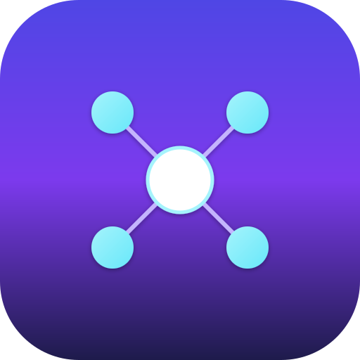
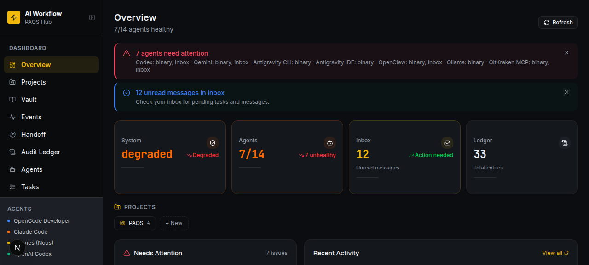
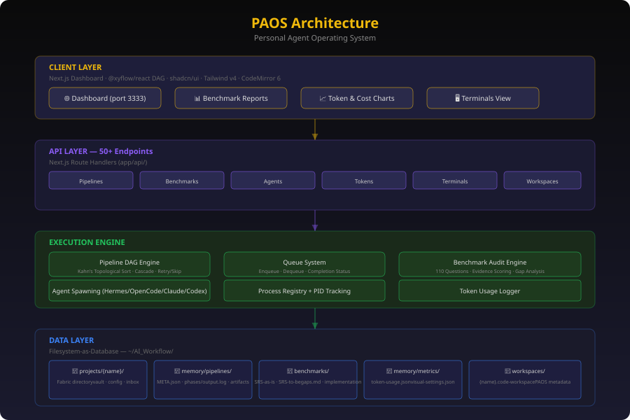
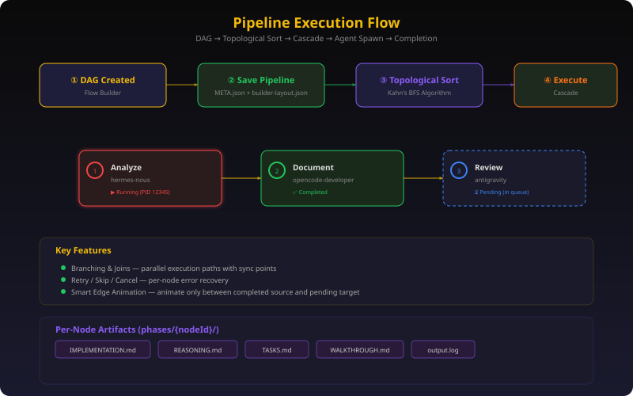
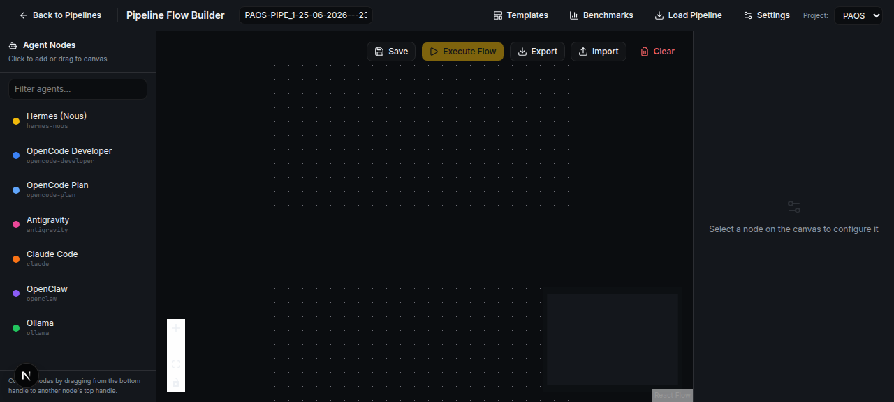
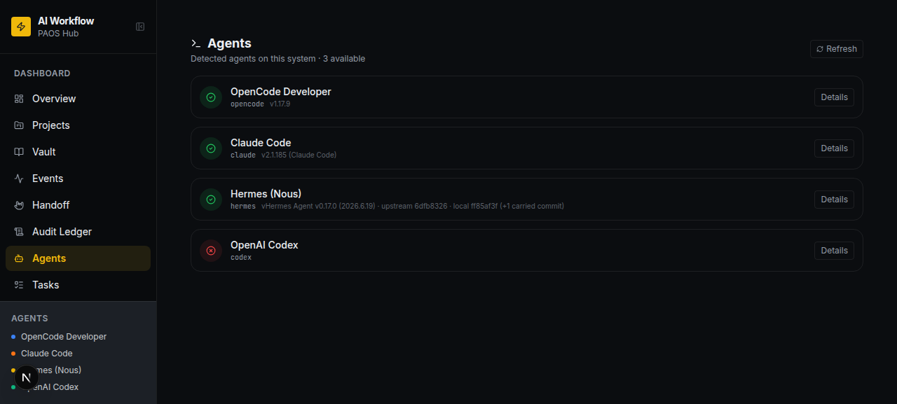
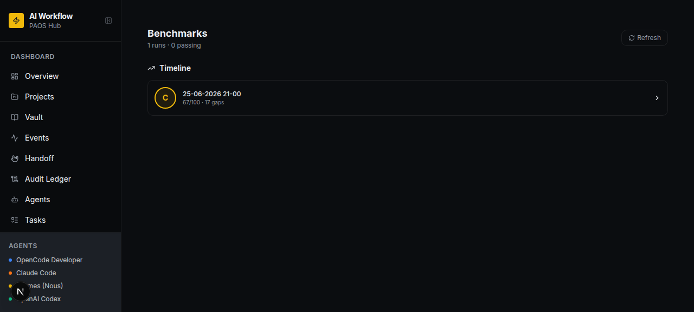
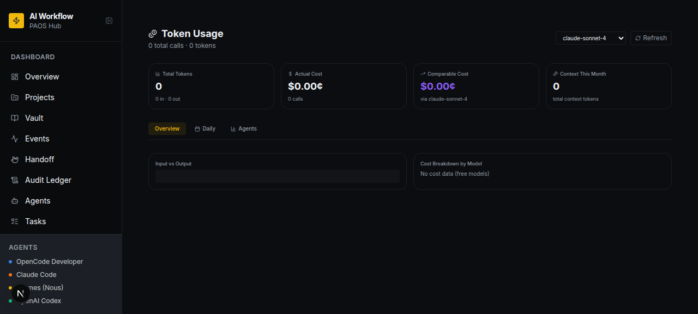

<p align="center">
  
</p>

<h1 align="center">🧠 PAOS — Personal Agent Operating System</h1>

<p align="center">
  <b>A multi-agent orchestration framework: a written constitution that separates planning from execution from review, an append-only ledger every agent writes to, and a dashboard to run it all from.</b>
</p>

<p align="center">
  
  
  
  
  
  
</p>

---

## 📖 What PAOS is

Run Claude Code, Codex, Gemini, and Hermes side by side and they don't know about each other — no shared memory, no shared audit trail, nothing stopping one agent from stepping on what another just did. PAOS gives them one workspace and one set of rules to work under: a constitution, a shared ledger, and a dashboard where you build a pipeline, assign each step to whichever agent should own it, and watch it run.



---

## ⚖️ The constitution

Every agent operates under `workflow.md` — the **H-Factor Protocol** — before it's allowed to touch a bash command or edit a file. Four invariants, enforced structurally rather than just requested in a prompt:

| Invariant | Meaning |
|---|---|
| **Separation of Powers** | Planner ≠ Reviewer ≠ Executor ≠ Orchestrator. No agent controls more than one phase of a task. |
| **Audit Immutability** | Ledger entries are append-only — nothing gets edited or deleted after the fact. |
| **Identity First** | Every action is attributed to a declared agent identity (`agents/<name>/soul.md`). |
| **Skill Boundary** | An agent can only act within what its own `soul.md` says it's allowed to do. |

The safety gate this produces: no agent runs `bash` or `edit` without a Peer Review token — a `## REVIEW [PASS|FAIL|CONDITIONAL]` block the **Architect** agent appends to the plan. A `FAIL` blocks execution outright. In practice that's a 3-phase flow — **Plan → Review → Execute** — logged to the agent's own event file and the global ledger before a commit happens.

Each agent has a distinct "soul": the Architect is skeptical by default and cites `workflow.md` line-by-line in its reviews; the Coordinator delegates but never executes, reporting back as Objective → Delegated To → Status → Next Step; the Developer and Codex take approved plans and build them, logging every file touched. It's less "AI agents in a folder" and more a small organization with defined roles.

---

## 🗂️ How it's organized



**The Fabric** — global, always-on infrastructure shared by every project: the ledger, the knowledge base, per-agent config and secrets, the skills library, MCP server definitions, the agent registry, and a FIFO pipeline queue.

**Per-project sandboxes** — each project gets `memory/pipelines/{project}/` with its own pipelines, ledger, kanban, agent inboxes, vault, and secrets. A project gets its own aliased agent identities (`MyProject_claude` vs. the global `claude`), so nothing about one project's audit trail crosses into another's.

None of it touches a database. The dashboard is a Next.js 16 App Router app with 63 API routes that read and write markdown/JSON on disk. Pipelines execute as DAGs ordered by Kahn's topological sort, and each node spawns its assigned agent as a subprocess with its own prompt, file references, and PID.

---

## 🖥️ Inside the dashboard

### Pipelines




Drag out a DAG in the visual builder (`@xyflow/react`), assign an agent per node, run it. Branches and joins handle parallel work with sync points; a failed node can be retried, skipped, or the whole run cancelled; pausing mid-run lets you edit `INTERVENE.md` before resuming. Eight starter templates cover the common shapes (Quick Dev, Analyze-Implement, PR Review, Bug Fix), and any saved pipeline reopens in the builder for a re-run.

### Agents



Eleven identities in the registry — Hermes as orchestrator, Claude Code, Codex, Gemini, Antigravity for review/audit, OpenClaw, Developer, Architect, Coordinator, Ollama, Signal — each auto-detected via CLI version check and each carrying a role prompt you can override per pipeline node.

### Benchmarks



A 110-question, evidence-based audit across 9 weighted categories (OOP, data structures, and security weigh heaviest; graph theory least). Every run outputs a full audit, a combined gaps file, before/after SRS documents via the `system-analysis-and-design` skill, and an implementation plan. Gaps sit on a four-column kanban — Pending, In Progress, Fixed, Won't Fix — and any gap converts straight into a new pipeline.

### Tokens & cost



Per-agent cost breakdown, a 14/30-day histogram split by input/output tokens, a calendar view of daily spend, and cost comparisons against what the same usage would run on GPT-4, Gemini, DeepSeek, or any other model's pricing.

### Tasks, Ledger, Inbox, Handoff, Git View, Vault

Tasks move `draft → approved → in_progress → done`, and a cron-driven watcher executes anything marked approved without further prompting. The Ledger is the immutable log Article I mandates, browsable globally or per project. Inbox is the messaging bus between agents. Handoff is a living document rewritten every session so whoever's next — human or agent — knows what happened and what's open. Git View gives a commit graph and diff viewer with commits mapped back to agent identity. Vault is Obsidian-compatible access to daily notes and chat transcripts.

---

## 🔢 By the numbers

| | |
|---|---|
| API endpoints | 63, across 24 resource groups — [docs/api.md](docs/api.md), or try `/api-playground` live |
| Dashboard pages | 18 |
| Agent identities | 11, defined in `agents/registry.json` |
| MCP servers | 7 shared servers (`shared-memory`, `scaffold`, `gitkraken`, `context7`, Hostinger domains/DNS, browser automation) — [mcp/README.md](mcp/README.md) |
| Shared skills | 5 (review loop, project scaffolder, system analysis & design, skill creator, VPS kit) — [skills/INDEX.md](skills/INDEX.md) |
| Benchmark audit | 110 questions, 9 categories |
| Pipeline templates | 8 |
| Stack | Next.js 16 · React 19 · TypeScript · Tailwind 4 · `@xyflow/react` |

---

## 🚀 Getting started

**Ubuntu / Debian**
```bash
sudo apt update && sudo apt install -y git curl nodejs npm python3
git clone https://github.com/7kim/PAOS.git
cd PAOS/dashboard
npm install
cp .env.example .env   # add your API keys
npm run dev             # → http://localhost:3333
```
Or `bash install-ubuntu.sh` from the repo root.

**macOS**: `bash install-mac.sh`

**Windows** (as Administrator):
```powershell
Set-ExecutionPolicy RemoteSigned -Scope CurrentUser
.\install-windows.ps1
```

**Docker**:
```bash
cp docker/secrets.env.template docker/secrets.env   # fill in your keys
docker compose -f docker/docker-compose.yaml up -d
```

### Wiring up agents

```bash
# Hermes
pip install hermes-agent && hermes init

# Claude Code
npm install -g @anthropic-ai/claude-code
```
Codex, Gemini, and OpenClaw install and get auto-detected the same way — see `agents/registry.json` for the full roster and each agent's own config file (`CLAUDE.md`, `GEMINI.md`, `ANTIGRAVITY.md`) for its exact session protocol: read the handoff, ledger, and inbox on the way in; rewrite the handoff, append to the ledger, and commit on the way out.

Global secrets (`OPENAI_API_KEY`, `ANTHROPIC_API_KEY`, etc.) go in `config/secrets/.env` — copy `config/secrets/.env.template` to start. `MEMORY_DIR` and `WORKSPACES_DIR` need to point at your PAOS root.

---

## 🧩 Under the hood

```
PAOS/
├── workflow.md                      # The constitution — H-Factor invariants + safety gate
├── Coding-Principles.md             # Architectural standards
├── Coding-Principles-Benchmark.md   # The 110-question audit
├── dashboard/                       # Next.js app — 18 pages, 63 API routes
│   ├── app/  components/  lib/
├── agents/                          # soul.md per agent + registry.json
├── skills/                          # Shared skill library
├── mcp/                             # MCP server configs
├── knowledge/                       # Shared docs, books, reference templates
├── config/{agent}/                  # Per-agent settings + secrets template
├── projects/{name}/  memory/pipelines/{project}/   # Per-project fabric + sandbox
├── benchmarks/                      # Benchmark run history
├── docs/                            # api.md, architecture.md, pipelines.md, examples.md
└── assets/ screenshots/             # Logo + screenshots used in this README
```

A pipeline node's execution, end to end:

```
Dashboard ──▶ API route ──▶ Pipeline engine ──spawn──▶ Agent subprocess
                                  │                          │
                                  ├─▶ Benchmark engine ─▶ gaps.md
                                  └─▶ Queue / file-tree      │
                                                     writes to phases/{nodeId}/
                                                     ├── output.log
                                                     ├── IMPLEMENTATION.md
                                                     ├── REASONING.md
                                                     └── WALKTHROUGH.md
```

For the full map — every page, API route, component, and library, one line each — see [PAOS-Entities.md](PAOS-Entities.md).

---

## 🔍 Worth knowing

- Secrets are gitignored everywhere (`config/secrets/.env`, `.env`, `*.key`, `*.pem`) — only `.env.template` placeholders are tracked, and that's the way it should stay.
- File reads go through path-traversal protection, API inputs are validated, and TypeScript strict mode is on throughout.
- A couple of machine-specific details are currently tracked in the repo and worth swapping for placeholders before treating this as a public template: `skills/INDEX.md` lists a real AWS EC2 IP address under the VPS Kit skill, and the dashboard's default config references a specific Tailscale hostname. Neither is a secret exactly, but neither needs to be sitting in a public repo either.
- The Docker README's clone URL points at a different GitHub path than the rest of the docs (`abdullaabdulhakeem25/AI_Workflow` vs. this repo's actual `7kim/PAOS`) — worth a pass to make every doc point at the same place.

---

## 🤝 Contributing

1. Read `Coding-Principles.md` before touching architecture, and `workflow.md` before touching the agent protocol itself.
2. Run `Coding-Principles-Benchmark.md` before opening a PR.
3. Every gap from a benchmark run should end up Fixed or explicitly Won't Fix — no silent drops.
4. Keep to the naming conventions: kebab-case files, plural API resources.

---

## 📄 License

MIT — free to use, modify, and distribute.
