\newpage

# 1. Introduction

## 1.1 Purpose

This document is the complete System Requirements Specification (SRS) and system design for **AI_Workflow PAOS** (Personal Agent Operating System), a locally-hosted multi-agent orchestration harness built and operated by Abdullah Abdul Hakim at NodeAlgo. It covers the system as it exists today at version 2.0.0, governed by the H-Factor Protocol v2.1.0. It serves as the authoritative reference for understanding the system's architecture, operational contracts, agent roles, memory model, and pipeline mechanics.

## 1.2 Scope

AI_Workflow PAOS is a file-system-native, Git-anchored multi-agent orchestration environment that coordinates multiple AI coding and reasoning agents (Claude Code, OpenCode, Codex, Gemini, Antigravity, Hermes, Ollama, OpenClaw) around a unified shared memory hub (Obsidian vault), a governance constitution (H-Factor), and a cross-agent pipeline system (/h-pipeline).

**In scope (Current State):**
- H-Factor constitutional governance with four invariants (I1–I4)
- Multi-agent roster with individual identities, inboxes, and git credentials
- Three-tier shared memory (Tier A: context, Tier B: task board, Tier C: inboxes)
- MCP servers: `shared-memory` (12 tools) and `scaffold` (2 tools)
- Antigravity Review Loop skill (plan → review → execute → walkthrough)
- /h-pipeline cross-agent plan-then-execute command
- Next.js orchestration dashboard (localhost:3333)
- Per-agent structured logging and dual-logging mandate
- Skills registry (antigravity-review-loop, system-analysis-and-design, project-scaffolder, skill-creator)
- Obsidian vault as shared persistent memory
- Agent-commit protocol via `agent-commit.sh`
- Docker deployment support

**Out of scope:**
- Multi-tenant or SaaS deployment
- External user authentication / authorization
- Commercial licensing or billing
- Cloud-native infrastructure (Kubernetes, managed DBs)
- External API gateway or public endpoints

## 1.3 Definitions, Acronyms, Abbreviations

| Term | Definition |
|---|---|
| PAOS | Personal Agent Operating System |
| H-Factor | Hyper-Structured Factor — the governance protocol governing all PAOS activity |
| MCP | Model Context Protocol — Anthropic's protocol for tool extensions to AI agents |
| SRS | System Requirements Specification |
| PM | Project Manager — the planning agent role (OpenCode `@plan`) |
| FR | Functional Requirement |
| NFR | Non-Functional Requirement |
| Vault | The Obsidian vault at `~/AI_Workflow/vault/` — PAOS shared memory hub |
| Ledger | `global_ledger.md` — append-only audit trail for all agent actions |
| Soul | Agent identity definition file (`agents/<name>/soul.md` or `<name>.md`) |
| Pipeline | A plan-then-execute handoff: PLAN.md + TASKS.md routed to an executor via MCP |
| Antigravity | Artifact-driven review loop: TASKS.md → IMPLEMENTATION_PLAN.md → WALKTHROUGH.md |
| Inbox | Per-agent message queue at `memory/inbox/<agent>/` |
| Task Card | YAML-frontmatter markdown file in `memory/tasks/` tracking a work item |

## 1.4 References

- H-Factor Protocol v2.1.0 — `~/AI_Workflow/workflow.md`
- IEEE Std 830-1998: Recommended Practice for Software Requirements Specifications
- Anthropic Model Context Protocol Specification
- Claude Code Documentation — Anthropic
- OpenCode Multi-Agent CLI Documentation
- Obsidian Vault Documentation

## 1.5 Document Overview

| Section | Content |
|---|---|
| 1 | Introduction |
| 2 | Literature Review |
| 3 | SWOT and PESTLE Analysis |
| 4 | Planning Phase |
| 5 | Methodology |
| 6 | Functional and Non-Functional Requirements |
| 7 | Process and Data Modelling |
| 8 | System Design |
| 9 | UML Diagrams |
| 10 | MVP Design |
| 11 | Testing |
| 12 | Deployment Plan |
| 13 | Maintenance Plan |
| 14 | References |

\newpage

# 2. Literature Review

## 2.1 Existing Solutions

| Tool | Strengths | Weaknesses (vs PAOS use case) |
|---|---|---|
| LangChain Agents | Rich ecosystem, Python-native, many integrations | No file-system memory model, no git audit, no cross-tool agent identity |
| AutoGen (Microsoft) | Multi-agent conversations, code execution | No persistent vault, no constitutional governance, no per-agent git identity |
| CrewAI | Role-based agents, task flows | SaaS-centric, no local-first memory, no MCP integration, no H-Factor governance |
| Cursor / Windsurf | IDE-native AI coding | Single-agent, no orchestration pipeline, no cross-session shared memory |
| Claude Code (standalone) | Excellent code reasoning, MCP support | No multi-agent coordination, no pipeline routing, no audit ledger |
| OpenDevin / SWE-Agent | GitHub issue resolution | Narrow scope (issue→PR), no constitutional governance, no multi-tool roster |
| Zapier AI Agents | Workflow automation | Cloud-only, no coding capability, no shared memory, no audit trail |

## 2.2 Gap Identified

No existing tool combines: (1) a constitutional governance layer that enforces separation of planning, review, and execution roles; (2) a file-system-native, Obsidian-integrated shared memory model that is vendor-agnostic; (3) per-agent git identity so every action is attributed and auditable in the repo history; (4) an MCP-based inter-agent communication protocol that works across heterogeneous AI tools (Claude, OpenAI, Google, local models); and (5) a cross-agent pipeline command that lets any planner agent submit structured work to any executor agent without synchronous coupling. PAOS fills this gap as a locally-operated, operator-sovereign multi-agent harness.

## 2.3 Academic Context

The PAOS design draws on several foundational concepts in multi-agent systems:
- **Separation of concerns** (Brooks, 1975) — enforced as H-Factor I1
- **Append-only audit logs** — distributed ledger principles applied to local file storage
- **Blackboard architecture** (Engelmore & Morgan, 1988) — implemented as the Obsidian vault shared memory
- **Role-based access control** — implemented as per-agent permission scopes in `registry.json`
- **Pipeline-and-filter architecture** — implemented as the /h-pipeline command flow

\newpage

# 3. Analysis Frameworks

## 3.1 SWOT Analysis

| | Positive | Negative |
|---|---|---|
| **Internal** | **Strengths:** Vendor-agnostic agent roster; file-system-native memory (no DB dependency); constitutional governance prevents runaway agents; per-agent git identity creates immutable audit trail; MCP extensibility; Obsidian vault enables human-readable shared memory | **Weaknesses:** Single-operator only; setup complexity (12+ tools to configure); no web UI for memory browsing (vault requires Obsidian client); pipeline is async — no real-time agent-to-agent streaming; no automated agent health recovery |
| **External** | **Opportunities:** MCP ecosystem is growing rapidly; local LLM quality (Ollama/Qwen) improving; AI agent tooling market is nascent — first-mover advantage; could be packaged as an enterprise product | **Threats:** Cloud AI providers may ship native multi-agent orchestration; MCP protocol may change; local model quality gap vs API models may widen costs; operator lock-in to specific AI tools |

## 3.2 PESTLE Analysis

| Factor | Analysis |
|---|---|
| **Political** | AI regulation (EU AI Act, US EO 14110) may require audit trails — PAOS's global ledger is a compliance asset |
| **Economic** | Multiple AI subscriptions (Claude, OpenAI, Google) have cost; local models (Ollama) reduce API spend |
| **Social** | Growing developer appetite for AI-assisted workflows; privacy concerns favor local-first systems |
| **Technological** | MCP protocol adoption accelerating; VS Code extension ecosystem expanding; LLM context windows growing (reduces need for complex memory systems) |
| **Legal** | Operator owns all generated artifacts (no SaaS TOS clauses); git-attributed commits clarify IP provenance |
| **Environmental** | Local model inference has hardware energy cost; API inference externalizes energy to cloud providers |

\newpage

# 4. Planning Phase

## 4.1 Project Timeline

| Milestone | Description | Status |
|---|---|---|
| v0.1 | Initial agent roster + shared memory structure | Complete |
| v0.2 | H-Factor constitution drafted | Complete |
| v1.0 | MCP servers operational (shared-memory, scaffold) | Complete |
| v1.5 | Antigravity Review Loop skill integrated | Complete |
| v2.0 | /h-pipeline cross-agent command + dashboard | Complete |
| v2.1 | Agent registry, session protocol, dual-logging mandate | Complete (current) |

## 4.2 Stakeholders

| Stakeholder | Role | Interest |
|---|---|---|
| Abdullah Abdul Hakim | Operator / sole user | Full system control, productivity amplification |
| NodeAlgo | Business context | IP development, potential productization |
| AI Agent Providers | External dependency | Claude (Anthropic), GPT (OpenAI), Gemini (Google), Ollama (local) |

## 4.3 Constraints

- **Environment**: Linux workstation, `~/AI_Workflow/` root
- **Single operator**: no multi-user access control required currently
- **File-system native**: all memory in markdown files — no database
- **Git-anchored**: all changes committed via `agent-commit.sh`
- **MCP dependency**: inter-agent communication requires both MCP servers running

\newpage

# 5. Methodology

## 5.1 Development Approach

PAOS follows an **evolutionary prototyping** methodology — the system is built iteratively by its own agents. Each enhancement goes through the H-Factor 3-phase pipeline (Plan → Review → Execute), ensuring the system self-governs its own development.

## 5.2 H-Factor 3-Phase Execution Model

```
Phase A (Plan)     → PM produces IMPLEMENTATION_PLAN.md + TASKS.md
Phase B (Review)   → Architect issues PASS / FAIL / CONDITIONAL token
Phase C (Execute)  → Developer executes; logs to agent events.md + global_ledger.md
```

## 5.3 Agile Alignment

- **Sprint = pipeline task**: each PIPE-xxx is a self-contained sprint
- **Definition of Done**: task card status = `done` + dual-log entries + agent-commit
- **Retrospective**: WALKTHROUGH.md serves as the sprint retrospective artifact

\newpage

# 6. Functional and Non-Functional Requirements

## 6.1 Functional Requirements

### 6.1.1 Agent Management

| ID | Requirement | Priority | Tag |
|---|---|---|---|
| FR-AM-01 | The system shall maintain a registry of all active agents at `agents/registry.json` with identity, role, permissions, inbox, log path, and git identity | Must | MVP |
| FR-AM-02 | Each agent shall have a unique email identity used for git commits (`agent@paos.nodealgo.com`) | Must | MVP |
| FR-AM-03 | Agents shall only act within the capability boundary declared in their `soul.md` (H-Factor I4) | Must | MVP |
| FR-AM-04 | The system shall support direct agent invocation via `@agent-name <request>` syntax | Must | MVP |
| FR-AM-05 | The system shall support at minimum 12 agent roles: claude, opencode-developer, opencode-plan, opencode-architect, opencode-coordinator, codex, gemini, antigravity, antigravity-ide, openclaw, hermes, ollama | Should | MVP |

### 6.1.2 Shared Memory

| ID | Requirement | Priority | Tag |
|---|---|---|---|
| FR-SM-01 | The system shall provide a Tier A shared context at `memory/shared/context.md` (append-only thinking log) | Must | MVP |
| FR-SM-02 | The system shall provide a Tier B task board at `memory/tasks/` with YAML-frontmatter task cards tracking status through: proposed → needs_planning → planning → needs_review → approved → ready_for_execution → executing → done → blocked | Must | MVP |
| FR-SM-03 | The system shall provide Tier C agent inboxes at `memory/inbox/<agent>/` for asynchronous messaging | Must | MVP |
| FR-SM-04 | The system shall expose shared memory through an MCP server (`shared-memory`) with at minimum: read_ledger, read_context, read_inbox, append_ledger, write_context, send_message, create_task, read_task, list_agents, agent_commit, submit_pipeline | Must | MVP |
| FR-SM-05 | The Obsidian vault at `vault/` shall be symlinked to live `memory/` and `knowledge/` directories | Must | MVP |
| FR-SM-06 | The global ledger at `memory/global_ledger.md` shall be append-only — no entry shall ever be edited or deleted (H-Factor I2) | Must | MVP |

### 6.1.3 Pipeline Orchestration

| ID | Requirement | Priority | Tag |
|---|---|---|---|
| FR-PO-01 | The system shall support the `/h-pipeline <prompt>` command enabling any planner agent to submit a structured plan to an executor agent | Must | MVP |
| FR-PO-02 | Pipeline submission shall create: `memory/pipelines/PIPE-<id>/PLAN.md`, `TASKS.md`, `META.json`; a task card; an inbox message to the executor; and a global ledger entry | Must | MVP |
| FR-PO-03 | Pipeline default executor shall be `opencode-developer`; fallback shall be `hermes`; executor shall be overridable per pipeline via `config/pipeline-defaults.yaml` | Should | MVP |
| FR-PO-04 | The system shall support the Antigravity Review Loop: Phase 1 (produce TASKS.md + IMPLEMENTATION_PLAN.md) → Phase 2 (user review) → Phase 3 (execute) → Phase 4 (WALKTHROUGH.md) | Must | MVP |
| FR-PO-05 | Pipeline execution shall not begin without an Architect PASS or CONDITIONAL review token appended to IMPLEMENTATION_PLAN.md | Must | MVP |

### 6.1.4 Governance

| ID | Requirement | Priority | Tag |
|---|---|---|---|
| FR-GV-01 | The system shall enforce H-Factor I1: Planner ≠ Reviewer ≠ Executor ≠ Orchestrator roles never controlled by the same agent | Must | MVP |
| FR-GV-02 | The system shall enforce H-Factor I2: global_ledger.md entries are append-only | Must | MVP |
| FR-GV-03 | The system shall enforce H-Factor I3: every action attributed to a known agent stamp | Must | MVP |
| FR-GV-04 | The system shall enforce H-Factor I4: agents act only within declared capabilities | Must | MVP |
| FR-GV-05 | All agent commits shall use `bin/agent-commit.sh <agent> "<message>"` — never plain `git commit` | Must | MVP |

### 6.1.5 Session Protocol

| ID | Requirement | Priority | Tag |
|---|---|---|---|
| FR-SP-01 | At session start, each agent shall read HANDOFF.md, call read_ledger + read_inbox in parallel, and surface in-progress or blocked items | Must | MVP |
| FR-SP-02 | At session end, each agent shall rewrite HANDOFF.md and append a summary ledger row followed by `agent-commit.sh` | Must | MVP |
| FR-SP-03 | During work, agents shall call `append_ledger` after every significant action and `write_context` after any key decision | Must | MVP |
| FR-SP-04 | Every session shall produce or update: agent events.md, global_ledger.md, daily note, chat summary, and shared context entry | Should | MVP |

### 6.1.6 Dashboard

| ID | Requirement | Priority | Tag |
|---|---|---|---|
| FR-DB-01 | The system shall provide a Next.js dashboard at localhost:3333 | Should | MVP |
| FR-DB-02 | The dashboard shall display the global ledger (last N rows, clickable entries) | Should | MVP |
| FR-DB-03 | The dashboard shall display the task board with clickable task cards | Should | MVP |
| FR-DB-04 | The dashboard shall display per-agent inbox and activity status | Should | MVP |
| FR-DB-05 | The dashboard shall display handoff prompts and pipeline status | Should | MVP |

### 6.1.7 Knowledge Base

| ID | Requirement | Priority | Tag |
|---|---|---|---|
| FR-KB-01 | The system shall maintain a canonical knowledge base at `knowledge/` symlinked as `vault/knowledge/` | Must | MVP |
| FR-KB-02 | Before finalizing any plan, agents shall scan `knowledge/` for relevant references | Must | MVP |
| FR-KB-03 | The scaffold MCP server shall provide `list_templates` and `scaffold_project` tools consuming templates from `knowledge/templates/` | Should | MVP |

## 6.2 Non-Functional Requirements

### 6.2.1 Performance

| ID | Requirement |
|---|---|
| NFR-P-01 | MCP server tool calls shall complete within 2 seconds for read operations |
| NFR-P-02 | Pipeline submission (submit_pipeline MCP call) shall complete within 5 seconds |
| NFR-P-03 | Dashboard shall load initial data within 3 seconds on localhost |
| NFR-P-04 | Agent-commit script shall complete within 10 seconds |

### 6.2.2 Reliability

| ID | Requirement |
|---|---|
| NFR-R-01 | The global ledger shall never be truncated or overwritten — entries are permanent |
| NFR-R-02 | MCP servers shall restart automatically if they crash (process manager or systemd) |
| NFR-R-03 | Git is the system of record — any crash recovery begins with `git log` |

### 6.2.3 Security

| ID | Requirement |
|---|---|
| NFR-S-01 | API keys shall reside only in `config/secrets/.env` which shall be gitignored |
| NFR-S-02 | Docker secrets shall reside only in `docker/secrets.env` which shall be gitignored |
| NFR-S-03 | Agent permission scopes in `registry.json` shall be enforced — no agent exceeds declared read/write/execute scope |

### 6.2.4 Maintainability

| ID | Requirement |
|---|---|
| NFR-M-01 | All agent configuration shall be declarative (YAML/JSON/Markdown) — no hardcoded values in binary scripts |
| NFR-M-02 | New agents shall be addable by: adding a soul.md, an inbox directory, a log file, and a registry.json entry |
| NFR-M-03 | New skills shall be addable by: creating a `skills/<name>/SKILL.md` and registering in the skills registry |

### 6.2.5 Usability

| ID | Requirement |
|---|---|
| NFR-U-01 | All shared memory artifacts shall be human-readable markdown — no binary formats |
| NFR-U-02 | The Obsidian vault shall be openable by the Obsidian desktop application without plugin dependencies |
| NFR-U-03 | The `/h-pipeline` command shall be invokable identically from any planner agent |

\newpage

# 7. Process and Data Modelling

## 7.1 Context Diagram (Level 0 DFD)

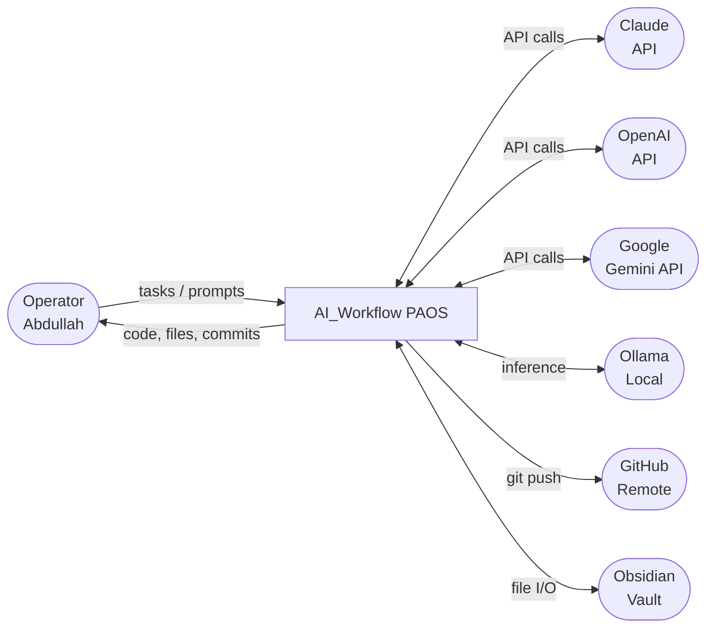

## 7.2 Level 1 DFD — Core Processes

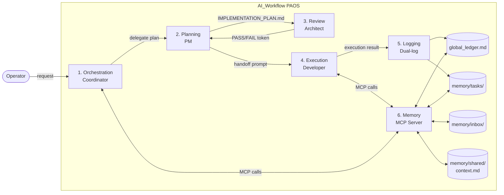

## 7.3 Entity Relationship Diagram

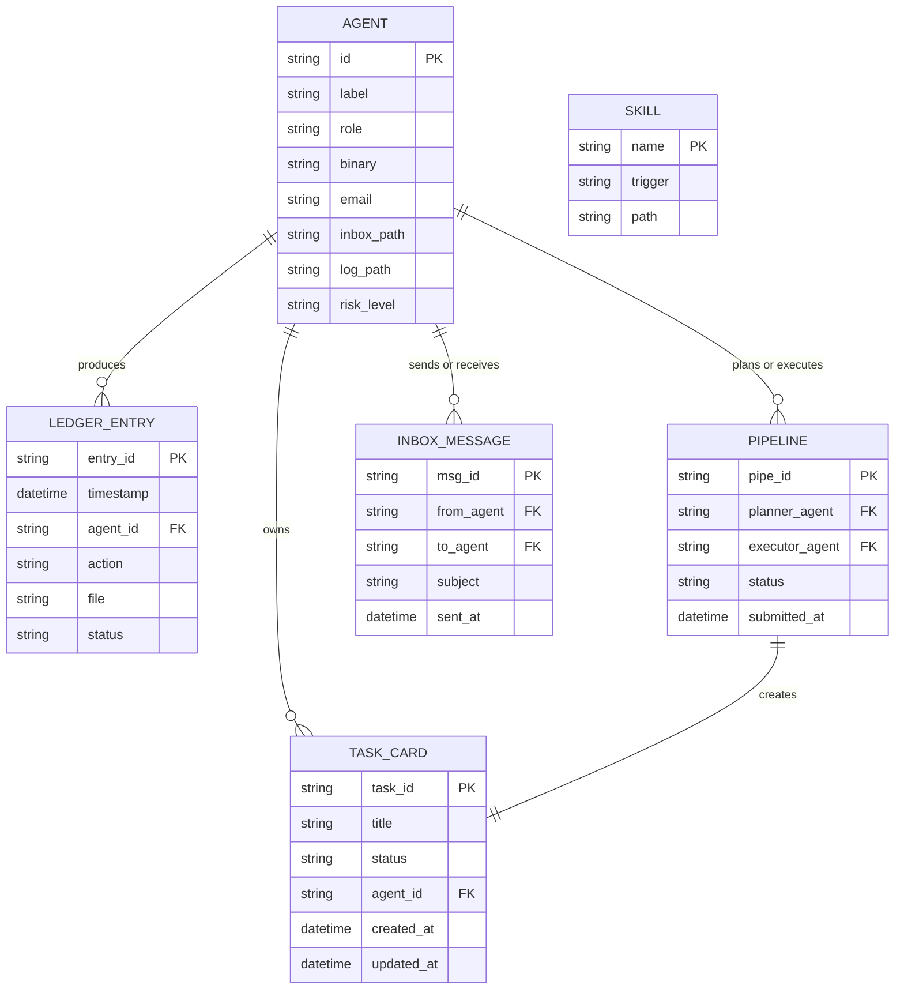

## 7.4 Task Status State Machine

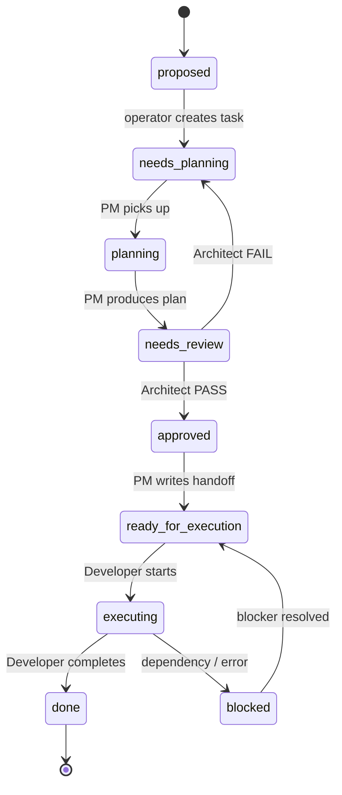

\newpage

# 8. System Design

## 8.1 Architecture Overview

PAOS uses a **federated file-system architecture** where all state lives in structured markdown files, Git is the system of record, and agents communicate through a shared MCP server layer rather than direct API calls to each other.

```
~/AI_Workflow/
├── agents/            ← Agent soul definitions + registry
├── skills/            ← Skill implementations (SKILL.md + assets)
├── knowledge/         ← Canonical knowledge base (markdown)
├── mcp/               ← MCP server implementations (Node.js)
│   ├── shared-memory-server/   ← 12-tool memory MCP
│   └── scaffold-server/        ← 2-tool scaffold MCP
├── memory/            ← Shared memory (symlink → logs/)
│   ├── shared/context.md
│   ├── tasks/
│   ├── prompts/
│   ├── pm-logs/
│   ├── inbox/<agent>/
│   ├── pipelines/PIPE-xxx/
│   └── global_ledger.md
├── logs/              ← Per-agent event logs
├── config/            ← All AI tool configuration
├── dashboard/         ← Next.js orchestration UI
├── vault/             ← Obsidian vault (symlinks to memory/ + knowledge/)
├── bin/               ← Operational scripts (agent-commit.sh, github-setup.sh)
└── docker/            ← Docker Compose deployment
```

## 8.2 Agent Architecture

Each agent is defined by a declarative profile with three components:

1. **Soul** (`agents/<name>.md` or `agents/<name>/soul.md`) — identity, role, pipeline position, protocols
2. **Registry entry** (`agents/registry.json`) — binary, config paths, MCP servers, permissions, git identity, health checks
3. **Runtime configuration** (`config/<tool>/`) — tool-specific settings (CLAUDE.md, opencode.json, etc.)

### 8.2.1 Agent Role Hierarchy

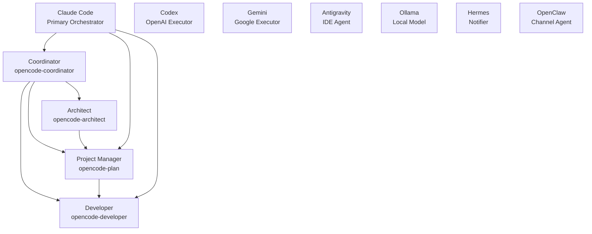

## 8.3 MCP Server Design

### 8.3.1 shared-memory MCP Server

**Runtime**: Node.js (`mcp/shared-memory-server/index.js`)
**Environment variables**: `MEMORY_DIR`, `KNOWLEDGE_DIR`, `REPO_ROOT`

| Tool | Description |
|---|---|
| `read_ledger` | Returns last N rows from global_ledger.md |
| `read_context` | Returns content of memory/shared/context.md |
| `read_inbox` | Returns messages for a specific agent from inbox |
| `append_ledger` | Appends a new row to global_ledger.md (append-only) |
| `write_context` | Appends a structured entry to shared/context.md |
| `send_message` | Writes a message file to an agent's inbox directory |
| `create_task` | Creates a YAML-frontmatter task card in memory/tasks/ |
| `read_task` | Returns a specific task card |
| `list_agents` | Returns the agent roster from registry.json |
| `agent_commit` | Runs agent-commit.sh with provided agent + message |
| `submit_pipeline` | Creates PIPE-xxx directory, task card, inbox message, ledger entry |
| `process_notes` | Processes notes.md action items |

### 8.3.2 scaffold MCP Server

**Runtime**: Node.js (`mcp/scaffold-server/index.js`)
**Environment variables**: `TEMPLATES_DIR`

| Tool | Description |
|---|---|
| `list_templates` | Lists available project templates from knowledge/templates/ |
| `scaffold_project` | Copies and parameterizes a template into a new project directory |

## 8.4 Pipeline Architecture

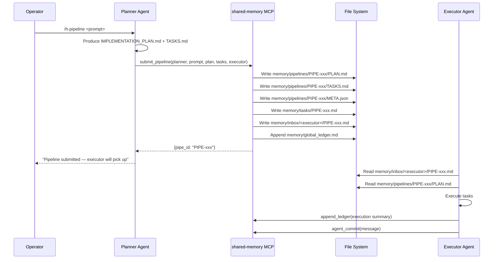

## 8.5 Memory Tier Architecture

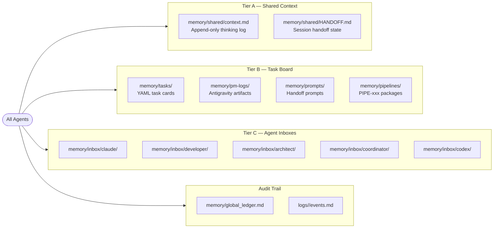

## 8.6 Dashboard Architecture

**Stack**: Next.js 15, TypeScript, Tailwind CSS
**Port**: 3333
**Data source**: File system reads (markdown files) via Node.js API routes

| Route | Data Source | Description |
|---|---|---|
| `/` | global_ledger.md | Ledger overview |
| `/ledger` | memory/global_ledger.md | Full ledger view |
| `/tasks` | memory/tasks/ | Task board |
| `/inbox` | memory/inbox/ | Agent inboxes |
| `/plans` | memory/pm-logs/ | PM artifacts |
| `/handoff` | memory/shared/HANDOFF.md | Session handoff |
| `/agents` | agents/registry.json | Agent roster |
| `/settings` | config/ | Configuration |

\newpage

# 9. UML Diagrams

## 9.1 Use Case Diagram

**Actors**: Operator, Claude Agent, OpenCode Agent, Architect Agent, Coordinator Agent

**Primary Use Cases**:
- Submit task
- Invoke /h-pipeline
- Review plan (Architect)
- Execute task (Developer)
- Read/write shared memory (all agents)
- View dashboard (Operator)
- Commit with agent identity (all agents)
- Send inbox message (all agents)

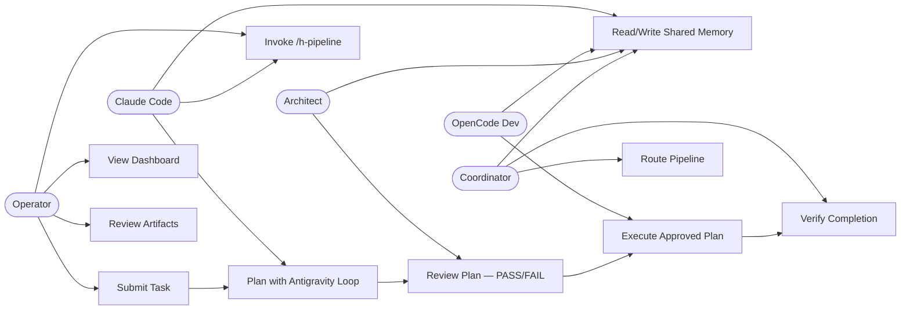

## 9.2 Class Diagram

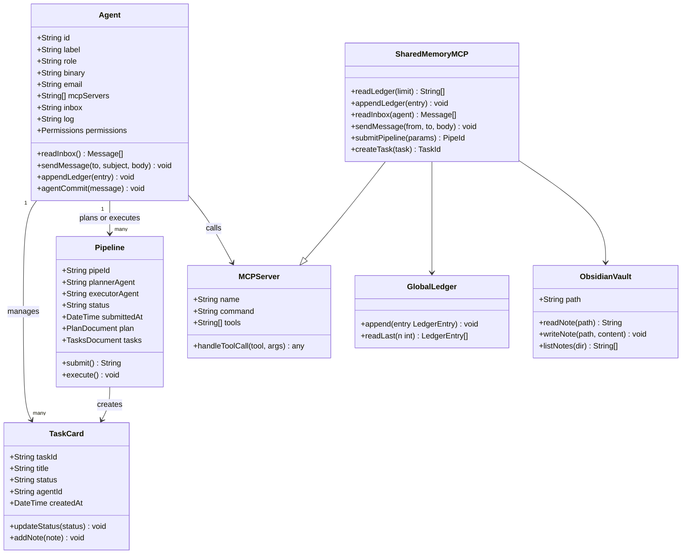

## 9.3 Sequence Diagram — Antigravity Review Loop

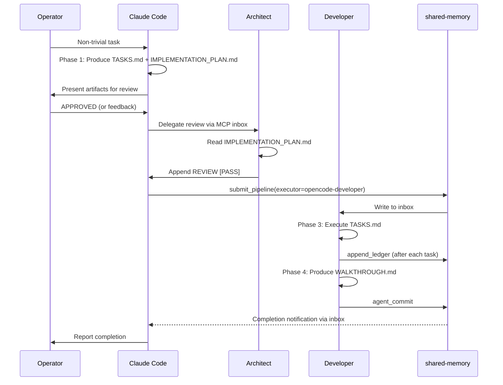

## 9.4 Component Diagram

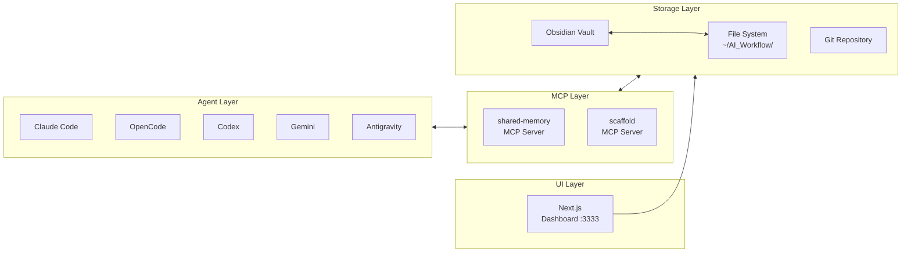

## 9.5 Deployment Diagram

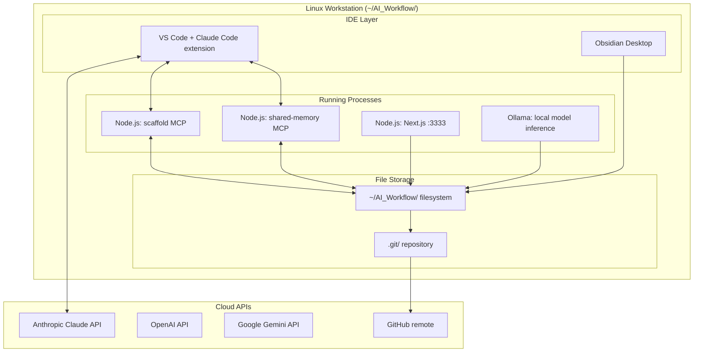

## 9.6 Activity Diagram — /h-pipeline Flow

```mermaid
flowchart TD
    START([Operator types /h-pipeline]) --> PLAN[Planner produces\nIMPLEMENTATION_PLAN.md\n+ TASKS.md]
    PLAN --> SUBMIT[Call submit_pipeline MCP]
    SUBMIT --> WRITE1[Write PIPE-xxx/PLAN.md]
    SUBMIT --> WRITE2[Write PIPE-xxx/TASKS.md]
    SUBMIT --> WRITE3[Write PIPE-xxx/META.json]
    SUBMIT --> WRITE4[Write memory/tasks/PIPE-xxx.md]
    SUBMIT --> WRITE5[Write inbox/<executor>/PIPE-xxx.md]
    SUBMIT --> WRITE6[Append global_ledger.md]
    WRITE1 & WRITE2 & WRITE3 & WRITE4 & WRITE5 & WRITE6 --> NOTIFY[Inform operator:\n"Pipeline submitted"]
    NOTIFY --> POLL{Executor\npicks up inbox?}
    POLL -->|Yes| EXEC[Executor reads plan\nand executes tasks]
    POLL -->|No| POLL
    EXEC --> LOG[Executor appends ledger\nand commits]
    LOG --> DONE([Done])
```

\newpage

# 10. MVP Design

## 10.1 MVP Feature Set

The PAOS MVP consists of the minimal set of components required to operate a governed multi-agent pipeline on a single workstation:

| Feature | MVP | Scalable |
|---|---|---|
| Shared memory MCP server | ✅ | ✅ |
| Scaffold MCP server | ✅ | ✅ |
| H-Factor constitutional governance | ✅ | ✅ |
| Agent registry (registry.json) | ✅ | ✅ |
| Global ledger (append-only) | ✅ | ✅ |
| Tier A shared context | ✅ | ✅ |
| Tier B task board | ✅ | ✅ |
| Tier C agent inboxes | ✅ | ✅ |
| Antigravity Review Loop skill | ✅ | ✅ |
| /h-pipeline command | ✅ | ✅ |
| agent-commit.sh script | ✅ | ✅ |
| Session protocol (HANDOFF.md) | ✅ | ✅ |
| Obsidian vault integration | ✅ | ✅ |
| Next.js dashboard | ✅ | ✅ |
| Docker Compose deployment | — | ✅ |
| Multi-project ledgers | — | ✅ |
| Skills: system-analysis-and-design | ✅ | ✅ |
| Skills: project-scaffolder | ✅ | ✅ |
| Skills: skill-creator | ✅ | ✅ |
| Agent health monitoring | — | ✅ |
| Per-pipeline config overrides | — | ✅ |

## 10.2 MVP Architecture

The MVP runs as a set of local processes communicating through the file system. No network service is exposed externally.

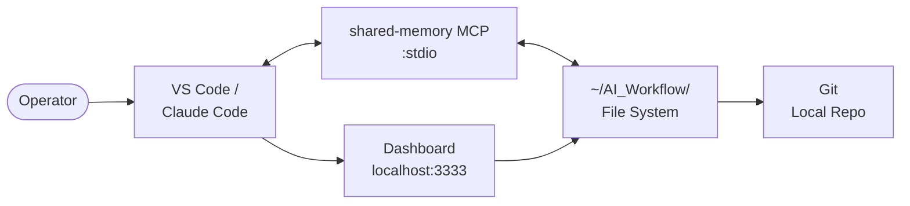

## 10.3 Scalable Evolution

| Phase | Description |
|---|---|
| Phase A (Current) | Single operator, local file system, stdio MCP, Git local |
| Phase B | Docker Compose, persistent volumes, scheduled ledger backups |
| Phase C | Multi-project support, automated health checks, pipeline retry logic |
| Phase D | Productization — multi-tenant, REST API, web dashboard, enterprise harness |

\newpage

# 11. Testing

## 11.1 Testing Strategy

PAOS is tested through a combination of operational verification and integration tests.

| Level | Method | Tooling |
|---|---|---|
| Unit | MCP tool function tests | Node.js test runner |
| Integration | Agent pipeline end-to-end | Manual + scripted |
| System | Full /h-pipeline flow | Shell scripts |
| Regression | Ledger integrity check | `grep` + `wc` on global_ledger.md |
| UI | Dashboard functionality | Manual browser testing |

## 11.2 Requirements Traceability Matrix

| FR ID | Test Case | Method | Pass Criteria |
|---|---|---|---|
| FR-SM-04 | MCP read_ledger returns last N rows | Call MCP tool, verify row count | Response contains N rows |
| FR-SM-06 | Ledger append-only verification | Count rows before/after append | Row count increases by 1 |
| FR-PO-02 | Pipeline submission creates all artifacts | Call submit_pipeline, check files | All 4 artifacts present |
| FR-PO-05 | Execution blocked without PASS token | Attempt execution, check gating | Agent refuses without token |
| FR-GV-05 | Agent commit uses agent-commit.sh | Run commit, check git log author | Author = `<agent>@paos.nodealgo.com` |
| FR-SP-01 | Session start reads HANDOFF + ledger | Observe session start | Both reads confirmed |
| FR-DB-01 | Dashboard loads at localhost:3333 | Browser GET | HTTP 200, page renders |
| FR-KB-02 | Plan cites knowledge/ references | Read IMPLEMENTATION_PLAN.md | Knowledge Check section present |

## 11.3 Health Check Protocol

The `registry.json` defines per-agent health checks:

| Check | Method |
|---|---|
| `binary` | `which <binary>` returns exit 0 |
| `config` | Config file exists and is parseable |
| `mcp` | MCP server responds to list_tools |
| `identity` | Agent git identity matches registry entry |
| `inbox` | Inbox directory exists and is writable |
| `log` | Log file exists and is appendable |

\newpage

# 12. Deployment Plan

## 12.1 Local Deployment (Primary)

```bash
# 1. Clone repo
git clone <repo-url> ~/AI_Workflow

# 2. Install MCP server dependencies
cd ~/AI_Workflow/mcp/shared-memory-server && npm install
cd ~/AI_Workflow/mcp/scaffold-server && npm install

# 3. Install dashboard dependencies
cd ~/AI_Workflow/dashboard && npm install

# 4. Configure secrets
cp config/secrets/.env.template config/secrets/.env
# Edit .env with API keys

# 5. Start dashboard
cd ~/AI_Workflow/dashboard && npm run dev

# 6. Configure Claude Code MCP
# Add shared-memory and scaffold to ~/.claude/mcp.json
```

## 12.2 Docker Deployment (Optional)

```bash
cp docker/secrets.env.template docker/secrets.env
# Edit secrets.env
docker compose -f docker/docker-compose.yaml up -d
# Dashboard: http://localhost:3333
```

## 12.3 GitHub Remote Setup

```bash
~/AI_Workflow/bin/github-setup.sh  # First time (interactive browser auth)
git push                            # Subsequent pushes
```

\newpage

# 13. Maintenance Plan

## 13.1 Routine Operations

| Task | Frequency | Method |
|---|---|---|
| Archive old ledger entries | Monthly | `grep` date filter + move to archive |
| Update agent registry | As needed | Edit registry.json + test health checks |
| Add new skill | As needed | Create skills/<name>/SKILL.md + register |
| Update workflow.md | As needed | H-Factor amendment process (Article VII) |
| Backup vault | Weekly | `git push` + optional rsync |
| Prune inbox messages | As needed | Delete processed .md files from inbox dirs |
| Update MCP servers | As needed | `npm install` + restart |

## 13.2 Agent Onboarding Protocol

To add a new agent to PAOS:
1. Create `agents/<name>.md` (soul definition)
2. Add entry to `agents/registry.json`
3. Create `memory/inbox/<name>/` directory
4. Create `logs/<name>/events.md` file
5. Add config under `config/<tool>/`
6. Register MCP bindings in agent's config
7. Run health checks from registry

## 13.3 Constitution Amendment Protocol

Changes to `workflow.md` require (Article VII):
1. Proposal in IMPLEMENTATION_PLAN.md
2. Architect PASS review
3. Ledger entry
4. Commit: `Agent[Coordinator]: Amended workflow.md — <summary>`

\newpage

# 14. References

1. H-Factor Protocol v2.1.0 — `~/AI_Workflow/workflow.md`
2. IEEE Std 830-1998: IEEE Recommended Practice for Software Requirements Specifications. IEEE, 1998.
3. Anthropic. *Model Context Protocol Specification*. 2024.
4. Anthropic. *Claude Code Documentation*. 2025.
5. Engelmore, R., & Morgan, T. (Eds.). *Blackboard Systems*. Addison-Wesley, 1988.
6. Brooks, F. P. *The Mythical Man-Month*. Addison-Wesley, 1975.
7. OpenCode Multi-Agent CLI Documentation. 2025.
8. Obsidian. *Obsidian Vault Documentation*. Obsidian.md, 2024.
9. Next.js. *App Router Documentation*. Vercel, 2025.
10. NodeAlgo PAOS Agent Registry — `~/AI_Workflow/agents/registry.json`

---

*Document produced by Claude Code [PAOS] — Agent[claude] — 2026-05-21*
*Classification: Internal — AI_Workflow PAOS v2.0.0*
