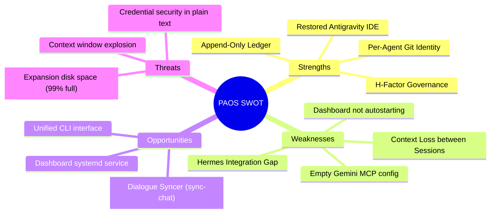

# PAOS System & Ubuntu Developer Setup Audit
## H-Factor Protocol Compliance & SWOT Analysis

This document provides a comprehensive audit of the PAOS (Personal Agent Operating System) configuration, agent integration status, and the underlying Ubuntu developer environment.

---

## Agent Integration Status

An audit of the agent registry, configuration files, and `soul.md` identity definitions shows the following status:

| Agent | Integration Status | Configuration Path | Soul File | MCP Registry | Notes |
| :--- | :--- | :--- | :--- | :--- | :--- |
| **Claude Code** | **Fully Integrated** | `config/claude/CLAUDE.md` | - | `~/.claude/mcp.json` | Symbolically linked to `~/.claude/`. |
| **Gemini** | **Fully Integrated** | `config/gemini/` | `agents/gemini/soul.md` | `mcp/mcp-config.json` | First-class executor agent. |
| **Antigravity 2.0** | **Fully Integrated** | `config/antigravity2/` | `agents/antigravity/soul.md` | `mcp/mcp-config.json` | General CLI (`agy`) and workspace integration. |
| **Antigravity IDE** | **Fully Integrated** | `~/.antigravity-ide/` | `agents/antigravity/soul.md` | Shared | Electron desktop IDE restored, sandbox fixed. |
| **Codex** | **Fully Integrated** | `config/codex/` | `agents/codex/soul.md` | Shared | Integrated via instructions and environment variables. |
| **OpenCode** | **Fully Integrated** | `config/opencode/opencode.json` | `agents/{developer,plan,architect,coordinator}/soul.md` | Shared | Governed by constitutional roles (PM, Dev, Arch, Coord). |
| **OpenClaw** | **Fully Integrated** | `config/openclaw/` | `agents/openclaw/soul.md` | Shared | Chat channel interface (Telegram/Slack/etc.). |
| **Hermes Agent** | **NOT INTEGRATED** | *None* | *None* | *None* | No configuration or soul files exist. |

### Hermes Agent Gap & Recommendation
The Hermes agent is currently **not integrated** within the PAOS repository. To fully integrate Hermes:
1. Create `agents/hermes/soul.md` to define its role, capabilities, and boundaries.
2. Add the `hermes` agent to the roster in `workflow.md` (Article VI / roster tables) and the Next.js dashboard registry.
3. Configure its config path under `config/hermes/` and register the `shared-memory` MCP server for its execution context.

---

## SWOT Analysis

### 1. Strengths (Internal, Helpful)
- **Robust Governance Framework**: The H-Factor Protocol enforces strict Separation of Powers (PM planning, Architect review, Coordinator verification, Developer execution), maintaining code quality and protocol compliance.
- **Append-Only Auditing**: The `global_ledger.md` provides an immutable audit trail of every single action taken by any agent.
- **Per-Agent Git Identity**: commits are automatically attributed to specific agent email addresses (e.g. `gemini@paos.nodealgo.com`), enabling clear visualization of agent contributions in gitgraph.
- **Desktop & CLI Parity**: The Antigravity IDE is fully recovered with SUID root permissions applied to `chrome-sandbox`, and user extensions/settings are successfully migrated.

### 2. Weaknesses (Internal, Harmful)
- **Dialogue Context Gap**: When switching agents, agents have only loaded the last 20 lines of the audit ledger and general summaries. The actual dialogue history (user prompts and agent responses) is not preserved, causing agents to lose the thread of conversation.
- **Manual Dashboard Startup**: The Next.js dashboard is not configured as a system service (e.g. via `systemd` or `pm2`), meaning it does not auto-start on boot.
- **Empty configurations**: `config/gemini/config/mcp_config.json` is currently blank, which can prevent the Gemini CLI from auto-loading MCP tools.
- **Hermes Agent Exclusion**: Hermes is missing from the registry, leaving a gap in the requested multi-agent pipeline.

### 3. Opportunities (External, Helpful)
- **Cross-Agent Chat Continuity**: Implementing an automated dialogue syncer (`sync-chat.py`) that converts the active conversation log (`transcript.jsonl`) into a shared Markdown transcript (`active_chat_transcript.md`). This allows any agent to resume the chat with full context.
- **Dashboard Service Daemonization**: Creating a systemd unit file for the dashboard so it runs persistently at `http://localhost:3333` without manual terminal execution.
- **Unified agent-commit utility**: Enhancing `bin/agent-commit.sh` to automatically push changes and update the ledger.

### 4. Threats (External, Harmful)
- **Expansion Disk Exhaustion**: The `/dev/sda1` drive (mounted at `/run/media/dev/Expansion`) is **99% full** (only 22 GB remaining). If project repositories or logs grow on this drive, writes will fail, halting all agent execution.
- **Context Window Overflow**: If the shared chat transcript grows excessively long, reading it in its entirety at session start could exhaust LLM context windows or increase token usage costs. (Mitigation: Implement truncation for tool output blocks).
- **Plaintext Secret Exposure**: Sudo passwords and API keys are stored in plaintext `.env` files. While gitignored, local file access by unverified agents or packages poses a security risk.

---

## Action Plan & Improvements

1. **Implement Cross-Agent Chat Continuity (Immediate)**
   - Create `bin/sync-chat.py` to parse the active Antigravity conversation log (`transcript.jsonl`) and output it to `vault/chats/active_chat_transcript.md`.
   - Update agent soul files and configurations so they read `active_chat_transcript.md` at session start.
2. **Address Disk Space Issues**
   - Warn the operator to clean up `/run/media/dev/Expansion` or migrate active project files to the root SSD (`/dev/sdb2`), which has 102 GB of free space.
3. **Formalize Antigravity Agent Soul**
   - Create `agents/antigravity/soul.md` to define its role as a desktop IDE orchestrator.
4. **Daemonize Dashboard**
   - Create a systemd service file to automatically start the dashboard.
