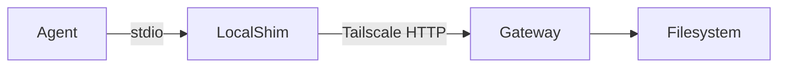

# Multi-Machine PAOS Architecture

> Design document for scaling PAOS (Personal Agent Operating System) across multiple VPS machines connected via Tailscale.
>
> **Status:** Draft  
> **Version:** 1.0.0  
> **Date:** 2026-06-26

---

## Table of Contents

1. [Current Architecture (Single VPS)](#1-current-architecture-single-vps)
2. [Design Requirements & Constraints](#2-design-requirements--constraints)
3. [Architecture Options](#3-architecture-options)
   - [Option A: Shared Filesystem (NFS / Tailscale Serve)](#option-a-shared-filesystem-nfs--tailscale-serve)
   - [Option B: Tailscale Funnel + Distributed Inboxes](#option-b-tailscale-funnel--distributed-inboxes)
   - [Option C: Federation via Shared-Memory MCP Gateway](#option-c-federation-via-shared-memory-mcp-gateway)
   - [Option D: Hybrid — Local Executors + Remote Ledger + P2P Pipeline Relay](#option-d-hybrid--local-executors--remote-ledger--p2p-pipeline-relay)
4. [Recommended Approach](#4-recommended-approach)
5. [Component Ownership Map](#5-component-ownership-map)
6. [Implementation Steps](#6-implementation-steps)
7. [Migration Path from Single-VPS](#7-migration-path-from-single-vps)
8. [Risks and Mitigations](#8-risks-and-mitigations)
9. [Appendix: Tailscale Configuration Reference](#appendix-tailscale-configuration-reference)

---

## 1. Current Architecture (Single VPS)

### Current Topology

```
┌─────────────────────────────────────────────────────────┐
│                   Single VPS (dev)                       │
│  ┌──────────┐    ┌──────────────┐    ┌───────────────┐  │
│  │ Dashboard │────▶ Pipeline     │────▶ Agent         │  │
│  │ :3333     │    │ Engine       │    │ Subprocesses  │  │
│  │ Next.js   │    │ (DAG/Kahn)   │    │ (Hermes,      │  │
│  └──────────┘    └──────────────┘    │  OpenCode,    │  │
│       │               │               │  Claude, etc.)│  │
│       │               │               └───────┬───────┘  │
│       ▼               ▼                       │          │
│  ┌────────────────────────────────────────────▼──────┐   │
│  │           Memory & Filesystem                      │   │
│  │  ~/AI_Workflow/memory/                              │   │
│  │    ├── inbox/{agent}/          # Agent inboxes      │   │
│  │    ├── pipelines/              # Pipeline state     │   │
│  │    ├── global_ledger.md        # Audit trail        │   │
│  │    ├── shared/                 # Shared context     │   │
│  │    ├── queue/                  # Pipeline queue     │   │
│  │    └── metrics/                # Token tracking     │   │
│  │                                                    │   │
│  │  ~/AI_Workflow/agents/        # Registry + souls   │   │
│  │  ~/AI_Workflow/mcp/           # MCP servers        │   │
│  │  ~/.local/bin/                # Agent PATH         │   │
│  └────────────────────────────────────────────────────┘   │
└─────────────────────────────────────────────────────────┘
```

### Key Characteristics

- **Dashboard + Pipeline Engine + Agents** all on one machine
- **Agent spawning:** `spawn("bash", ["-c", "cat IMPLEMENTATION.md | opencode run"])` — local subprocess
- **Agent-to-agent communication:** File-based via `memory/inbox/{agent}/` and `memory/pipelines/`
- **MCP servers:** Local stdio subprocesses spawned by agents
- **Git identity:** All agents commit to the same local git repo
- **Pipeline queue:** JSON file in `memory/queue/queue.json`
- **Tailnet:** Already connected (`100.87.116.120`), with a second machine at `100.103.28.56` (developer)

### Current Tailscale Topology

| Machine     | Tailscale IP    | Status  |
|-------------|-----------------|---------|
| `dev`       | `100.87.116.120` | Online  |
| `developer` | `100.103.28.56`  | Online  |
| `p30-pro`   | `100.96.219.9`   | Offline |

---

## 2. Design Requirements & Constraints

### Constraints

| # | Constraint | Why |
|---|-----------|-----|
| C1 | Agent-to-agent communication is file-based | PAOS architecture depends on `memory/inbox/` and `memory/pipelines/` files |
| C2 | MCP servers are local subprocesses (stdio transport) | MCP protocol standard; agents expect MCP on stdio, not HTTP |
| C3 | Dashboard is Next.js on port 3333 | Existing implementation; changing port breaks existing integrations |
| C4 | Agents use `~/.local/bin/` for PATH access | Agent lifecycle management expects binaries at this path |
| C5 | Tailscale serves the dashboard to the tailnet | Existing tailnet is already set up |

### Requirements

| # | Requirement | Priority |
|---|------------|----------|
| R1 | Distribute agents across machines | High |
| R2 | Dashboard remains a single pane of glass | High |
| R3 | Pipeline execution works across machines | High |
| R4 | Agent inboxes readable/writable from any machine | High |
| R5 | Global ledger is unified (not per-machine) | Medium |
| R6 | Agent health checks across machines | Medium |
| R7 | MCP servers stay local but can be proxied | Medium |
| R8 | Minimal latency for pipeline cascading | Low |
| R9 | Rollback to single-VPS without data loss | High |

---

## 3. Architecture Options

### Option A: Shared Filesystem (NFS / Tailscale Serve)

#### Concept

Mount a central `~/AI_Workflow` via NFS or rsync on all machines. Every machine sees the same filesystem. Agents run locally but read/write to the shared filesystem. The dashboard runs on one primary machine.

```
┌──────────────┐     ┌──────────────┐     ┌──────────────┐
│  Machine A    │     │  Machine B    │     │  Machine C    │
│  (Primary)    │     │              │     │              │
│               │     │              │     │              │
│  Dashboard    │     │  @claude     │     │  @opencode   │
│  Hermes       │     │  (executor)  │     │  (executor)  │
│  PipelineEng  │     │              │     │              │
│  ────────     │     │  ────────    │     │  ────────    │
│       │       │     │       │      │     │       │      │
│       ▼       │     │       ▼      │     │       ▼      │
│  ┌────────────┴─────┴────────┴─────┴─────┴────────┐    │
│  │           Shared NFS / Tailscale Serve          │    │
│  │  ~/AI_Workflow (read-write from all machines)   │    │
│  │  ├── memory/inbox/     (shared inboxes)         │    │
│  │  ├── memory/pipelines/ (shared pipeline state)  │    │
│  │  ├── memory/global_ledger.md (single audit)     │    │
│  │  └── memory/queue/     (shared queue)           │    │
│  └─────────────────────────────────────────────────┘    │
└──────────────────────────────────────────────────────────┘
```

#### Pros
- **Transparent:** Agents don't need modification — they just write files
- **Simple consistency:** One filesystem, one truth
- **Ledger is naturally unified:** One `global_ledger.md`
- **Existing code works:** Pipeline engine reads/writes files as before

#### Cons
- **NFS latency:** File operations over NFS are slower than local
- **Locking complexity:** Concurrent writes to the same file (e.g., ledger) can corrupt it
- **Tailscale Serve limits:** Tailscale Serve serves HTTP, not a filesystem protocol
- **Single point of failure:** NFS server goes down, everything stops
- **Network partition:** Split-brain if machines lose connectivity during writes

#### Tailscale Implementation

```bash
# On primary machine
tailscale serve --bg --https=8080 /home/dev/AI_Workflow/memory

# On secondary machines — syncthing or periodic rsync
# Tailscale does NOT natively serve a filesystem; use Tailscale SSH + rsync
```

#### Evaluation
- **R1 (Distribute agents):** ✅ Yes
- **R2 (Single pane):** ✅ Dashboard on primary
- **R3 (Cross-machine pipelines):** ✅ Shared filesystem
- **R4 (Shared inboxes):** ✅ Single filesystem
- **R5 (Unified ledger):** ✅ Naturally unified
- **R6 (Health checks):** ⚠️ Need separate mechanism
- **R9 (Rollback):** ✅ Just stop NFS

---

### Option B: Tailscale Funnel + Distributed Inboxes

#### Concept

Each machine runs its own local copy of the PAOS memory directory. Inboxes are exposed via Tailscale Funnel (HTTP). A lightweight relay daemon on each machine syncs inbox messages from remote machines into the local inbox. The pipeline engine is modified to use HTTP-based inbox reads/writes for remote agents.

```
┌────────────────────┐      ┌────────────────────┐
│  Machine A          │      │  Machine B          │
│  (Dashboard)        │      │                     │
│                     │      │  Local Memory       │
│  Local Memory       │      │  ├── inbox/claude/  │
│  ├── inbox/hermes/  │      │  ├── pipelines/     │
│  ├── pipelines/     │      │  └── ledger.md      │
│  ├── ledger.md      │      │                     │
│  └── queue/         │      │  Tailscale Funnel   │
│                     │      │  :8080/inbox/       │
│  Tailscale Funnel   │      │  :8080/pipelines/   │
│  :8080/inbox/       │      │                     │
│  :8080/pipelines/   │      │  Relay Daemon       │
│                     │      │  (syncloop)         │
│  Relay Daemon       │      │                     │
│  (syncloop)         │      │  Agents:            │
│                     │      │  - Claude Code      │
│  Agents:            │      │  - Codex            │
│  - Hermes           │      └────────────────────┘
│  - OpenCode Dev     │
└────────────────────┘
```

#### Pros
- **No shared filesystem needed:** Each machine is independent
- **Tailscale Funnel handles auth:** Built-in ACLs
- **No NFS dependency:** Avoids NFS performance issues
- **Resilient:** If one machine goes down, others continue with local state

#### Cons
- **Significant PAOS code changes needed:** Pipeline engine must use HTTP for remote agents
- **Split ledger:** Each machine has its own `global_ledger.md` — must merge
- **Inbox sync is eventually consistent:** Race conditions possible
- **Agent modification required:** Agents write to local filesystem, not remote inbox
- **Cascading delays:** Pipeline must poll remote agent status

#### Tailscale Implementation

```bash
# On each machine
tailscale funnel --bg 8080

# serve the inbox and pipelines directories via HTTP
# Use a simple file-server wrapper that serves the directory
```

#### Evaluation
- **R1:** ✅ Yes
- **R2:** ⚠️ Dashboard only sees its local ledger without merge logic
- **R3:** ⚠️ Pipeline engine needs significant changes
- **R4:** ⚠️ Eventually consistent, race conditions
- **R5:** ❌ Split ledger requires merge logic
- **R6:** ✅ Built-in Tailscale connectivity check
- **R9:** ⚠️ Data must be merged back

---

### Option C: Federation via Shared-Memory MCP Gateway

#### Concept

Replace the direct filesystem access with a networked version of the `shared-memory` MCP server. Instead of reading/writing local files, the MCP server communicates with a central memory gateway running on the primary machine. The gateway serializes all writes, preventing corruption. Agents continue to use MCP tools as before — the transport changes from `stdio` to `HTTP (Tailscale)`, but the agent-facing API stays identical.

```
┌────────────────────┐      ┌────────────────────┐
│  Machine A          │      │  Machine B          │
│  (Primary/Memory)   │      │                     │
│                     │      │  @opencode-dev      │
│  MCP Gateway        │      │  (agent)            │
│  (Tailscale :8080)  │      │                     │
│  ┌─────────────┐    │      │  MCP Client         │
│  │ Memory       │    │      │  (stdio →           │
│  │ Controller   │◄───┼──────┤   shared-memory     │
│  │ (serializes  │    │      │   via Tailscale     │
│  │  all writes) │    │      │   HTTP transport)   │
│  └──────┬───────┘    │      └────────────────────┘
│         │            │
│         ▼            │      ┌────────────────────┐
│  ┌─────────────┐    │      │  Machine C          │
│  │ Filesystem   │    │      │                     │
│  │ memory/      │    │      │  @claude            │
│  │   inbox/     │    │      │  (agent)            │
│  │   pipelines/ │    │      │                     │
│  │   ledger     │    │      │  MCP Client         │
│  └─────────────┘    │      │  (Tailscale HTTP)    │
└────────────────────┘      └────────────────────┘
```

#### Pros
- **Smallest agent impact:** Agents already use `shared-memory` MCP tools — only the transport changes
- **Serialized writes:** No file corruption; atomic operations via the gateway
- **Unified ledger:** One gateway, one truth
- **Existing dashboard works:** Dashboard reads local filesystem (or talks to gateway)
- **Clean abstraction:** MCP is the PAOS-native communication protocol

#### Cons
- **MCP transport change:** The `shared-memory` MCP server currently uses `stdio`; switching to HTTP means either:
  - (a) Run a separate HTTP MCP gateway proxy on each remote machine
  - (b) Modify the MCP server to listen on a TCP port
- **Latency:** Every MCP tool call from a remote agent goes over the network
- **Single point of failure:** Primary machine must be up
- **MCP stdio constraint:** Agents expect MCP servers as local subprocesses (C2) — must use a local shim that proxies to the remote gateway

#### MCP Transport Shim



A local shim script (e.g., `shared-memory-proxy.sh`) runs as the MCP server on remote machines and simply forwards stdio JSON-RPC to the gateway over Tailscale HTTP.

#### Evaluation
- **R1:** ✅ Yes
- **R2:** ✅ Dashboard on primary reads filesystem directly
- **R3:** ✅ Pipeline engine writes to shared gateway
- **R4:** ✅ Unified inbox via gateway
- **R5:** ✅ Single ledger
- **R6:** ✅ Gateway can track last-seen per agent
- **R9:** ✅ Remove shim, reset MCP config to local

---

### Option D: Hybrid — Local Executors + Remote Ledger + P2P Pipeline Relay

#### Concept

A pragmatic hybrid: each machine runs its own complete local PAOS stack (dashboard, memory, agents) but with a lightweight P2P relay daemon (`paos-relay`) that:

1. **Syncs inboxes** between machines via Tailscale (rsync over SSH, or Tailscale Funnel)
2. **Merges ledger entries** from all machines into a unified view
3. **Relays pipeline submissions** between machines (a pipeline submitted on Machine B can include agents on Machine A)
4. **Health-checks** all machines periodically

Each machine keeps a local copy of the entire `~/AI_Workflow` but designates one machine as the **Primary** (for dashboard and ledger merging).

```
┌────────────────────────┐     ┌────────────────────────┐
│  Machine A (Primary)    │     │  Machine B              │
│                         │     │                         │
│  Full ~/AI_Workflow/    │     │  Full ~/AI_Workflow/    │
│  ├── memory/            │     │  ├── memory/            │
│  │  ├── inbox/          │     │  │  ├── inbox/          │
│  │  ├── pipelines/      │     │  │  ├── pipelines/      │
│  │  ├── global_ledger   │     │  │  ├── global_ledger   │
│  │  └── relay/          │     │  │  └── relay/          │
│  ├── dashboard (:3333)  │     │  ├── dashboard (:3333)  │
│  └── agents/registry    │     │  └── agents/registry    │
│                         │     │                         │
│  paos-relay daemon      │◄───►│  paos-relay daemon      │
│  - sync inbox 30s       │     │  - sync inbox 30s       │
│  - merge ledger 60s     │     │  - forward pipelines    │
│  - relay pipelines      │     │  - health checks        │
│  - health check 15s     │     │                         │
└────────────────────────┘     └────────────────────────┘
```

#### Pros
- **Full redundancy:** Every machine can run independently
- **No NFS dependency:** Tailscale SSH/rsync is robust
- **Graceful degradation:** If primary goes down, any machine can take over
- **Dashboard on any machine:** Useful for local debugging

#### Cons
- **Data sync complexity:** Inbox and pipeline sync must be atomic and conflict-free
- **Ledger merging is complex:** Need deterministic merge order (timestamp-based)
- **Storage overhead:** Every machine has a full copy of AI_Workflow
- **Bandwidth:** rsync on every sync cycle for large directories
- **Sync delay:** 30-second inbox sync means pipeline handoff has latency

#### Evaluation
- **R1:** ✅ Yes
- **R2:** ✅ Primary dashboard shows merged view
- **R3:** ✅ Pipeline relay handles cross-machine execution
- **R4:** ⚠️ Eventually consistent inbox (30s delay)
- **R5:** ✅ Merged ledger
- **R6:** ✅ Built-in health checks
- **R9:** ✅ Just stop relay, each machine is self-sufficient

---

## Architecture Option Comparison

| Criteria | A: NFS Shared | B: Funnel + Dist | C: MCP Gateway | D: Hybrid/Relay |
|----------|:------------:|:----------------:|:--------------:|:---------------:|
| **Code changes required** | Minimal | Significant | Moderate | Moderate |
| **Single point of failure** | NFS server | No single point | Primary machine | Primary (for merge) |
| **Data consistency** | ✅ Strong | ❌ Weak | ✅ Strong | ⚠️ Eventually consistent |
| **Agent modification needed** | None | Significant | Shim only | None (relay handles) |
| **Latency per operation** | Medium (NFS) | Low (local + async sync) | Medium (MCP over HTTP) | Low (local + bg sync) |
| **Resilience** | Low | High | Medium | High |
| **Rollback simplicity** | ✅ Easy | ❌ Hard | ✅ Easy | ✅ Easy |
| **Operational complexity** | Medium | High | Medium | Medium |
| **Dashboard compatibility** | ✅ Direct | ⚠️ Needs merge | ✅ Direct | ✅ Merged view |

---

## 4. Recommended Approach

### Recommendation: Option C (MCP Gateway) + Option D (Hybrid Relay) — Tiered Hybrid

**Recommendation: Hybrid of Option C (MCP Gateway) and Option D (Relay)**

After evaluating all options against the constraints and requirements, the recommended approach is a **tiered hybrid** that combines the best of the MCP Gateway model (C) for real-time operations and the Relay model (D) for resilience:

#### Architecture Overview

```
                          ┌─────────────────────────────────┐
                          │     Tailscale Tailnet            │
                          │  100.x.x.x/10                    │
                          └─────────────────────────────────┘
                                     │
        ┌────────────────────────────┼────────────────────────────┐
        │                            │                            │
┌───────▼──────────┐     ┌──────────▼─────────┐     ┌──────────▼─────────┐
│  Machine A        │     │  Machine B           │     │  Machine C          │
│  TIER 1: Primary  │     │  TIER 2: Executor    │     │  TIER 2: Executor   │
│                   │     │                      │     │                     │
│  ┌─────────────┐  │     │  ┌──────────────┐    │     │  ┌──────────────┐   │
│  │ Dashboard   │  │     │  │ Agents:       │    │     │  │ Agents:       │   │
│  │ :3333       │  │     │  │ - Claude Code │    │     │  │ - OpenCode   │   │
│  │ PipelineEng │  │     │  │ - Codex       │    │     │  │ - Hermes     │   │
│  └──────┬──────┘  │     │  └───────┬───────┘   │     │  └──────┬───────┘   │
│         │         │     │          │            │     │         │          │
│  ┌──────▼──────┐  │     │  ┌───────▼────────┐  │     │  ┌──────▼────────┐ │
│  │ MCP Gateway  │  │     │  │ MCP Proxy Shim  │  │     │  │ MCP Proxy Shim│ │
│  │ (TCP :3100)  │◄─┼─────┼─►│ (stdio→HTTP     │◄─┼─────┼─►│ (stdio→HTTP   │ │
│  │              │  │     │  │  to Gateway)    │  │     │  │  to Gateway)  │ │
│  └──────┬───────┘  │     │  └─────────────────┘  │     │  └───────────────┘ │
│         │          │     │                       │     │                    │
│  ┌──────▼───────┐  │     │  ┌─────────────────┐  │     │  ┌──────────────┐  │
│  │ PAOS Relay    │◄─┼─────┼─►│ PAOS Relay      │◄─┼─────┼─►│ PAOS Relay   │  │
│  │ (bg sync)     │  │     │  │ (bg sync)       │  │     │  │ (bg sync)    │  │
│  └──────┬───────┘  │     │  └─────────────────┘  │     │  └──────────────┘  │
│         │          │     │                       │     │                    │
│  ┌──────▼───────┐  │     │  ┌─────────────────┐  │     │  ┌──────────────┐  │
│  │ Local FS      │  │     │  │ Local FS         │  │     │  │ Local FS     │  │
│  │ (source of    │  │     │  │ (local pipeline  │  │     │  │ (local pip-  │  │
│  │  truth)       │  │     │  │  cache + bin)    │  │     │  │  line cache) │  │
│  └───────────────┘  │     │  └──────────────────┘  │     │  └──────────────┘  │
└────────────────────┘     └─────────────────────────┘     └────────────────────┘
```

### Architecture Tiers

#### Tier 1: Primary Machine (Machine A)

Runs the central PAOS infrastructure:

| Component | Detail |
|-----------|--------|
| **Dashboard** | Next.js on port 3333, serves UI |
| **Pipeline Engine** | DAG executor, spawns local + remote agents |
| **MCP Gateway** | Modified `shared-memory` MCP server listening on Tailscale TCP port 3100 |
| **PAOS Relay** | Daemon that syncs state and monitors remote machines |
| **Filesystem** | Source of truth for all PAOS data |
| **Agents** | Hermes, any agent that benefits from low-latency FS access |
| **Tailscale Funnel** | (Optional) Exposes dashboard to wider network |

#### Tier 2: Executor Machines (Machine B, C, ...)

Run agents and a lightweight local shim:

| Component | Detail |
|-----------|--------|
| **Local FS** | Minimal local state — pipeline execution cache, agent binaries |
| **MCP Proxy Shim** | Tiny process: reads stdio, forwards JSON-RPC to Primary's MCP Gateway over Tailscale |
| **PAOS Relay Daemon** | Syncs local pipeline artifacts back to Primary; forwards pipeline submissions |
| **Agents** | Claude Code, OpenCode Developer, Codex, etc. |
| **~/.local/bin/** | Agent binaries as expected |
| **Dashboard (optional, read-only)** | Can run for local monitoring |

### Data Flow: Cross-Machine Pipeline

```
1. User submits pipeline on Dashboard (Machine A)
2. Pipeline Engine writes pipeline files (local FS on A)
3. Engine spawns local agents directly (subprocess on A)
4. For remote agents:
   a. Engine writes IMPLEMENTATION.md to memory/pipelines/{id}/phases/{node}/
   b. PAOS Relay syncs to Machine B via Tailscale rsync
   c. On Machine B, relay daemon detects new pipeline phase, spawns agent
   d. Agent reads IMPLEMENTATION.md, executes, writes output
   e. Relay syncs output back to Machine A
5. Dashboard polls pipeline state from local FS on A
```

### Data Flow: Agent Inbox Communication

```
Agent A (Machine A) wants to send message to Agent B (Machine B):
1. Agent A writes to memory/inbox/agent-b/message-001.md (local FS on A)
2. MCP Gateway serializes the write
3. Relay on A syncs inbox to Machine B (~5s interval)
4. Relay on B sees new message, Agent B picks it up

Agent B responds:
1. Agent B writes to memory/inbox/agent-a/response-001.md (local FS on B)
2. MCP Proxy Shim forwards write to Gateway (real-time)
3. Gateway writes to FS on A
4. Agent A sees response immediately
```

---

## 5. Component Ownership Map

### What MUST Be Local (Per Machine)

| Component | Reason |
|-----------|--------|
| **MCP server binaries** | MCP stdio transport (C2) |
| **Agent binaries** (`~/.local/bin/`) | Agents need PATH-accessible binaries (C4) |
| **Agent CLI tools** (opencode, claude, etc.) | Execution engine spawns subprocesses |
| **Pipeline phase cache** (local temp) | Each machine needs a working directory for agent output |
| **Agent configuration files** | Each agent reads its own config |

### What CAN Be Remote

| Component | Reason |
|-----------|--------|
| **Global ledger** (`global_ledger.md`) | Must be single source of truth |
| **Agent inboxes** (`memory/inbox/`) | File-based communication; can live on primary and be proxied |
| **Pipeline state** (`memory/pipelines/`) | Pipeline engine needs centralized view |
| **Shared context** (`memory/shared/`) | Single shared context for all agents |
| **Dashboard (UI)** | Single pane of glass; only one needs to serve |
| **Agent registry** (`agents/registry.json`) | Single registry for all machines |
| **Queue state** (`memory/queue/`) | Pipeline queue must be centralized |

### What COULD Be Local But Recommended Remote

| Component | Reason for Remote |
|-----------|-------------------|
| **Agent soul files** | Registry is authoritative; local cache optional |
| **Knowledge/docs** (`knowledge/`) | Centralized to avoid drift |
| **Skill definitions** (`skills/`) | Skills are defined once |

---

## 6. Implementation Steps

### Phase 1: Foundation (Week 1-2)

#### Step 1.1: MCP Gateway — Network-Enabled Shared Memory Server

**Goal:** Make `shared-memory` MCP server accessible over Tailscale TCP.

```bash
# 1. Modify shared-memory MCP server to optionally listen on TCP
#    Current: reads from stdin, writes to stdout (stdio)
#    New: --port flag starts TCP listener, accepts JSON-RPC over TCP

# File: ~/AI_Workflow/mcp/shared-memory-server/index.js
# Add:
#   if (process.argv.includes('--port')) {
#     const port = parseInt(process.argv[process.argv.indexOf('--port') + 1] || '3100');
#     net.createServer((socket) => {
#       // Handle JSON-RPC over TCP same as stdio
#     }).listen(port);
#   }
```

**Specification:**
- Add `--port` flag to existing MCP server
- Protocol: JSON-RPC 2.0 over length-prefixed TCP (same as stdio but framed for TCP)
- Auth: Tailscale MagicDNS handles authentication; optional API token for extra security
- Rate limiting: 100 req/s per IP
- Write serialization: Mutex on all write operations
- Cache: LRU cache for read-heavy operations (ledger reads, inbox listing)

#### Step 1.2: MCP Proxy Shim

**Goal:** A lightweight script that runs as the local MCP server on remote machines, forwarding all requests to the primary gateway.

```bash
# File: ~/AI_Workflow/bin/mcp-gateway-proxy.sh
#!/bin/bash
# MCP Gateway Proxy Shim
# Runs as the MCP server on remote machines
# Forwards all stdio JSON-RPC to primary gateway over Tailscale

GATEWAY_HOST="${GATEWAY_HOST:-100.87.116.120}"
GATEWAY_PORT="${GATEWAY_PORT:-3100}"

# Read JSON-RPC from stdin, send to gateway, write response to stdout
while IFS= read -r line; do
  response=$(echo "$line" | nc -q 1 "$GATEWAY_HOST" "$GATEWAY_PORT")
  echo "$response"
done
```

**Alternative (Node.js):**

```javascript
// ~/AI_Workflow/mcp/gateway-proxy/index.js
const net = require('net');
const GATEWAY = process.env.GATEWAY_HOST || '100.87.116.120';
const PORT = parseInt(process.env.GATEWAY_PORT || '3100');

let gatewaySocket = null;
function connect() {
  gatewaySocket = net.createConnection(PORT, GATEWAY);
  gatewaySocket.on('data', (data) => process.stdout.write(data));
  gatewaySocket.on('close', () => setTimeout(connect, 1000));
}
connect();

process.stdin.on('data', (data) => {
  if (gatewaySocket) gatewaySocket.write(data);
});
```

#### Step 1.3: PAOS Relay Daemon

**Goal:** A background daemon that syncs pipeline state and agent inboxes between machines.

```python
# ~/AI_Workflow/bin/paos-relay.py

"""
PAOS Relay Daemon — synchronizes pipeline state and agent inboxes
across Tailscale-connected machines.

Usage:
  paos-relay --primary            # Run as primary (Machine A)
  paos-relay --peer=100.103.28.56 # Run as peer (Machine B)
"""

import os
import json
import time
import subprocess
import argparse
import hashlib
from pathlib import Path

MEMORY_DIR = Path(os.environ.get('MEMORY_DIR', '/home/dev/AI_Workflow/memory'))
SYNC_INTERVAL = int(os.environ.get('RELAY_SYNC_INTERVAL', '5'))  # seconds
PEER_INBOXES = {}  # populated from config

def sync_inboxes():
    """Sync inbox directories with peers using rsync over Tailscale SSH."""
    for peer_ip, peer_config in PEER_INBOXES.items():
        for agent_dir in (MEMORY_DIR / 'inbox').iterdir():
            if agent_dir.is_dir():
                # Push our writes to peer
                remote_path = f"dev@{peer_ip}:{MEMORY_DIR}/inbox/{agent_dir.name}/"
                subprocess.run([
                    'rsync', '-az', '--delete',
                    str(agent_dir) + '/',
                    remote_path
                ], capture_output=True, timeout=30)

                # Pull peer writes from them
                subprocess.run([
                    'rsync', '-az', '--delete',
                    remote_path,
                    str(agent_dir) + '/'
                ], capture_output=True, timeout=30)

def merge_ledger():
    """Fetch remote ledger, merge with local, deduplicate by timestamp."""
    # TODO: Read remote ledger, merge with local, deduplicate
    pass

def health_check():
    """Check connectivity to all known peer machines."""
    results = {}
    for machine_id, ip in get_peer_machines().items():
        result = subprocess.run(
            ['tailscale', 'ping', ip, '-c', '1'],
            capture_output=True, timeout=10
        )
        results[machine_id] = {
            'reachable': result.returncode == 0,
            'latency': parse_ping_output(result.stdout)
        }
    write_health_report(results)

def relay_loop():
    """Main relay loop."""
    while True:
        try:
            sync_inboxes()
            # merge_ledger()  # less frequent
            health_check()
        except Exception as e:
            log_error(f"Relay error: {e}")
        time.sleep(SYNC_INTERVAL)
```

### Phase 2: Agent Registry on Primary (Week 2-3)

#### Step 2.1: Extend Agent Registry for Machine Assignment

Modify `~/AI_Workflow/agents/registry.json` to include machine assignments:

```json
{
  "agents": [
    {
      "id": "claude",
      "label": "Claude Code",
      "binary": "claude",
      "machine": "developer",
      "tailscale_ip": "100.103.28.56",
      "enabled": true,
      "mcpMode": "gateway-proxy",
      "gatewayHost": "100.87.116.120",
      "gatewayPort": 3100
    },
    {
      "id": "opencode-developer",
      "label": "OpenCode Developer",
      "binary": "opencode",
      "machine": "dev",
      "tailscale_ip": "100.87.116.120",
      "enabled": true
    }
  ],
  "machines": {
    "dev": {
      "tailscale_ip": "100.87.116.120",
      "role": "primary",
      "dashboard": true
    },
    "developer": {
      "tailscale_ip": "100.103.28.56",
      "role": "executor",
      "dashboard": false,
      "capabilities": ["claude", "codex"]
    }
  }
}
```

#### Step 2.2: Health Check Endpoint

Add an API route to the dashboard for cross-machine health:

```typescript
// ~/AI_Workflow/dashboard/app/api/health/route.ts
export async function GET() {
  const machines = await getKnownMachines();
  const results = await Promise.allSettled(
    machines.map(m => 
      fetch(`http://${m.tailscale_ip}:3333/api/health/ping`, 
        { signal: AbortSignal.timeout(5000) })
        .then(r => ({ machine: m.id, status: 'ok', latency: r.duration }))
        .catch(e => ({ machine: m.id, status: 'unreachable', error: e.message }))
    )
  );
  return NextResponse.json({ machines: results });
}
```

### Phase 3: Remote Agent Execution (Week 3-4)

#### Step 3.1: Modify Pipeline Engine for Remote Agents

The pipeline engine needs to know which machine an agent runs on and how to spawn it:

```typescript
// In execute-flow/route.ts — modify spawnNode()

async function spawnNode(nodeId: string, phases, order) {
  const node = nodeMap.get(nodeId);
  const agentId = node.data?.agentId;
  const agentConfig = await getAgentConfig(agentId);
  const targetMachine = agentConfig?.machine || 'local';

  if (targetMachine === 'local') {
    // Existing local spawn logic
    await spawnLocal(nodeId, phases, order);
  } else {
    // Remote spawn via PAOS Relay
    await spawnRemote(nodeId, phases, order, targetMachine);
  }
}

async function spawnRemote(nodeId, phases, order, machineId) {
  const machine = await getMachineConfig(machineId);

  // 1. Write phase artifacts to local pipeline dir (for dashboard visibility)
  // 2. Signal relay daemon on target machine via Tailscale HTTP
  const relayUrl = `http://${machine.tailscale_ip}:3101/pipeline/run`;
  await fetch(relayUrl, {
    method: 'POST',
    headers: { 'Content-Type': 'application/json' },
    body: JSON.stringify({
      pipelineId: pipelineId,
      nodeId: nodeId,
      phaseDir: phaseDir,
      agentId: agentId,
    }),
    signal: AbortSignal.timeout(30_000),
  });

  // 3. Remote relay spawns the agent, waits for completion, syncs output back
  // 4. Dashboard polls the pipeline files (written back by relay)
}
```

#### Step 3.2: PAOS Relay Pipeline Execution Endpoint

The relay daemon exposes a simple HTTP API for executing pipeline phases:

```
POST /pipeline/run  → execute pipeline phase on this machine
GET  /pipeline/status/{id}  → check phase status
POST /sync/pull     → pull latest pipeline state from primary
```

### Phase 4: Operational Tooling (Week 4-5)

#### Step 4.1: Machine Provisioning Script

```bash
#!/bin/bash
# ~/AI_Workflow/bin/setup-executor-machine.sh
# Run on a fresh VPS to set it up as a PAOS executor

# 1. Install Tailscale
curl -fsSL https://tailscale.com/install.sh | sh
sudo tailscale up --auth-key=$TAILSCALE_AUTH_KEY

# 2. Clone AI_Workflow (lightweight — just binaries + agent configs)
git clone https://github.com/7kim/AI_Workflow.git ~/AI_Workflow
cd ~/AI_Workflow

# 3. Install agents
bash bin/install-agent.sh claude
bash bin/install-agent.sh opencode

# 4. Install MCP Gateway Proxy
npm install --prefix mcp/gateway-proxy

# 5. Install and start PAOS Relay
sudo cp systemd/paos-relay.service /etc/systemd/system/
sudo systemctl enable --now paos-relay

# 6. Install MCP Proxy Shim
sudo cp systemd/mcp-gateway-proxy.service /etc/systemd/system/
sudo systemctl enable --now mcp-gateway-proxy

# 7. Register with primary
curl -X POST http://100.87.116.120:3333/api/machines/register \
  -H "Content-Type: application/json" \
  -d '{"id": "'$(hostname)'", "ip": "'$(tailscale ip -4)'", "agents": ["claude", "opencode"]}'
```

#### Step 4.2: Dashboard Machine Management Page

Add a new page at `dashboard/app/machines/` showing:
- All known machines with Tailscale IPs
- Online/offline status with last-seen timestamps
- Per-machine agent assignments
- Per-machine resource usage (CPU, memory, disk)
- Pipeline distribution (which machine ran which pipeline)

#### Step 4.3: Ledger Synchronization

Implement ledger merging in the relay daemon:

```python
def merge_ledger():
    """Merge remote ledgers into primary ledger."""
    # Strategy: timestamp-based merge with UUID deduplication
    # Each ledger entry gets a UUID at creation time
    # Primary collects all entries from peers
    # Sorts by timestamp
    # Deduplicates by UUID (first writer wins)
    # Writes merged result
    # Peers pull merged ledger back
    pass
```

---

## 7. Migration Path from Single-VPS

### Stage 0: Current (Single VPS)

```
Machine A (dev) — everything
```

### Stage 1: Add Secondary Machine as File-Only Executor

```
Machine A (dev): Dashboard, Pipeline Engine, Hermes, OpenCode Developer
Machine B (developer): Claude Code, Codex (no dashboard, no inbox sync yet)

Setup:
  - Install agents on Machine B
  - Machine B reads pipeline phases via rsync from Machine A
  - Machine B writes results back to Machine A via rsync
  - Manual sync (cron job every 30s)
```

### Stage 2: Implement MCP Gateway

```
Machine A: MCP Gateway on port :3100
Machine B: MCP Proxy Shim → Gateway

Changes:
  - Modify shared-memory server for TCP mode
  - Deploy proxy shim on Machine B
  - Update agent MCP configs on Machine B to use proxy shim
```

### Stage 3: Implement PAOS Relay

```
Machine A: PAOS Relay (primary mode)
Machine B: PAOS Relay (peer mode)

Changes:
  - Deploy relay daemon on both machines
  - Automated inbox sync (5s interval)
  - Automated pipeline state sync
  - Health check infrastructure
```

### Stage 4: Full Multi-Machine Pipeline Support

```
Machine A: Dashboard, MCP Gateway, Hermes
Machine B: Claude Code, Codex
Machine C (future): GPU machine for Ollama/local models

Changes:
  - Pipeline engine aware of machine assignments
  - Remote agent spawning via relay
  - Dashboard shows cross-machine pipeline status
  - Machine management UI
```

### Rollback Path

At any stage, rollback to single-VPS:

```bash
# On Machine A:
# 1. Update agent registry — set all agents to local
# 2. Stop relay daemon
# 3. Stop MCP gateway
# 4. Reset shared-memory server config to stdio mode
# 5. On Machine B — no changes needed, it's self-sufficient

# Data merge if needed:
rsync -az dev@100.103.28.56:~/AI_Workflow/memory/ ~/AI_Workflow/memory-merged/
```

---

## 8. Risks and Mitigations

| # | Risk | Likelihood | Impact | Mitigation |
|---|------|-----------|--------|------------|
| 1 | **Network partition** — machines lose connectivity mid-pipeline | Low | High | Pipeline phases are idempotent; relay reconnects and syncs missed state on reconnection |
| 2 | **File corruption** — concurrent writes to same file from multiple machines | Medium | High | MCP Gateway serializes all writes with a mutex; relay uses rsync with atomic file operations |
| 3 | **Clock skew** — timestamps for ledger entries differ across machines | Medium | Medium | Use monotonic clocks + UUID for ledger entries; primary machine's clock is authoritative |
| 4 | **MCP Gateway becomes bottleneck** — all remote MCP calls go through one machine | Medium | Medium | Gateway is lightweight (JSON-RPC relay); can horizontally scale with load balancer if needed |
| 5 | **Tailscale ACL misconfiguration** — machines can't reach each other | Low | High | Document required ACLs; test connectivity as first provisioning step |
| 6 | **Agent binary mismatch** — different versions on different machines | Low | Low | Use same install script on all machines; registry tracks binary versions |
| 7 | **Dashboard latency** — remote pipeline status updates are delayed by sync interval | Medium | Low | Reduce sync interval to 2-3s for pipeline state; real-time updates for local agents |
| 8 | **Split-brain data** — both primary and peer accept writes during partition | Low | High | Writes always go through MCP Gateway (primary); peers are read-only for shared state |
| 9 | **SSH key management** — Tailscale SSH requires keys on all machines | Low | Low | Tailscale SSH uses node keys, not SSH keys; minimal setup |
| 10 | **Pipeline submission to offline machine** — agent assigned to unreachable machine | Medium | Medium | Pre-flight health check before execution; fallback to local agent; user notification |

### Critical Risk: Data Consistency During Partition

**Problem:** If Machine B (executor) loses connectivity to Machine A (primary) mid-pipeline execution, the agent on Machine B continues working (writing to local FS). When connectivity resumes, state must be reconciled.

**Mitigation:**
1. Each pipeline phase gets a UUID (already in META.json)
2. Each phase file gets a `.state` file: `pending | running | completed | failed`
3. On reconnection, relay performs a three-way merge:
   - Compare phase states on both machines
   - If a phase completed on the remote but primary thinks it's running → update primary
   - If primary has a newer phase trigger than remote → ignore stale remote state
4. Write a reconciliation report to `memory/relay/reconciliation-log.md`

---

## Appendix: Tailscale Configuration Reference

### Tailscale ACL Recommendations

```json
// ~/AI_Workflow/research/tailscale-acl.json
{
  "acls": [
    // Allow all PAOS machines to communicate
    {"action": "accept", "src": ["tag:paos"], "dst": ["tag:paos:*"]},
    
    // Allow dashboard access from tailnet
    {"action": "accept", "src": ["*"], "dst": ["tag:paos-dashboard:3333"]},
  ],
  "tagOwners": {
    "tag:paos":          ["autogroup:admin"],
    "tag:paos-dashboard": ["autogroup:admin"],
  },
  "nodes": [
    {"name": "dev",        "ip": "100.87.116.120", "tags": ["tag:paos", "tag:paos-dashboard"]},
    {"name": "developer",  "ip": "100.103.28.56",  "tags": ["tag:paos"]},
  ]
}
```

### Useful Tailscale Commands

```bash
# Check connectivity
tailscale ping 100.103.28.56

# Expose dashboard to tailnet
tailscale serve --bg --https=3333 http://localhost:3333

# Expose MCP Gateway
tailscale serve --bg --tcp=3100 tcp://localhost:3100

# List all machines with status
tailscale status

# Check MagicDNS names
tailscale status --json | jq '.Self.DNSName'
```

### Ports Used

| Port | Protocol | Service | Machines |
|------|----------|---------|----------|
| 3333 | HTTP | PAOS Dashboard | Primary |
| 3100 | TCP | MCP Gateway | Primary |
| 3101 | HTTP | PAOS Relay API | All |
| 22 | SSH | Tailscale SSH (sync) | All |

---

## Appendix: Machine Profile Reference

### Primary Machine Profile
```
VPS Spec:
  - 4+ vCPU, 8+ GB RAM
  - 80+ GB SSD
  - Ubuntu 22.04+
  
Runs:
  - Dashboard (Next.js)
  - Pipeline Engine
  - MCP Gateway
  - PAOS Relay (primary mode)
  - Hermes agent
  - OpenCode Developer agent
  - PostgreSQL or SQLite (for dashboard state)
```

### Executor Machine Profile
```
VPS Spec:
  - 2+ vCPU, 4+ GB RAM
  - 40+ GB SSD
  - Ubuntu 22.04+
  
Runs:
  - PAOS Relay (peer mode)
  - MCP Gateway Proxy
  - 1-3 agent binaries
  - Local pipeline cache (~1-2 GB)
```

### GPU Machine Profile (Future)
```
VPS Spec:
  - 4+ vCPU, 16+ GB RAM
  - 1× GPU (A100 / RTX 4090)
  - 100+ GB SSD
  
Runs:
  - Ollama (local models)
  - PAOS Relay (peer mode)
  - Model-serving agents
```
