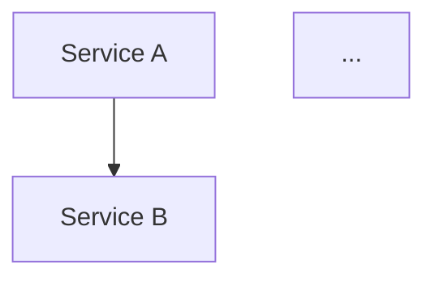

# Project Scaffolder — AI-Optimized Project Initialization

## Overview

This skill transforms an empty directory or a project idea into a fully scaffolded,
production-ready, AI-agent-optimized software project. It operates in **six rigid phases**
and produces a workspace that:

- Is **optimized for AI agents** to read, write, and modify with high efficiency
- Follows **professional software engineering standards** (linting, testing, CI/CD, security)
- Includes **full governance** (audit logs, ADRs, changelog, task tracking)
- Is **Docker-first** for reproducible development environments
- Uses **explicit dependency pinning** and **secure-by-default** configuration
- Produces **client-quality deliverables** with proper documentation

---

## The Six Phases

| Phase | Name | Gate |
|-------|------|------|
| 1 | Discovery | Survey completed, answers recorded |
| 2 | Architecture | Technology stack decided, ADRs written |
| 3 | Scaffolding | All files created in workspace |
| 4 | Validation | Lint, test, build, container health pass |
| 5 | Governance Initialization | Audit logs, ADRs, changelog seeded |
| 6 | Handoff | Onboarding doc, roadmap, task list delivered |

---

## Phase 1 — Discovery

### 1.1 Trigger Recognition

When the user says any of the following, load this skill:
- "new project"
- "scaffold project"
- "initialize project"
- "project setup"
- "create a new [type] project"
- "start a new project"
- Any request that implies bootstrapping a new codebase from scratch

### 1.2 Load the Survey

Before ANY file creation or code generation, read the full discovery survey from:

```
.opencode/skills/project-scaffolder/references/discovery-survey.md
```

Ask the user each question in order. Do not assume defaults without explicit confirmation.

### 1.3 Survey Conduct Rules

1. Present the survey as a structured questionnaire.
2. For each of the 10 categories, ask the specific questions listed in the survey reference.
3. If the user gives a brief answer, ask clarifying follow-ups in that category before moving on.
4. Record ALL answers in a survey response block before proceeding to Phase 2.
5. If the user says "use defaults" or "you decide", mark each assumption explicitly in the output.
6. **Do not skip questions.** Every answer informs the scaffolding output.

### 1.4 Survey Output Artifact

After the survey is complete, write a file at the project root:

```
SURVEY.md
```

This file captures all user answers in a structured format. It serves as the traceability anchor
for all architectural decisions that follow. Format:

```markdown
# Project Discovery Survey

**Project Name**: <user answer>
**Date**: <YYYY-MM-DD>

## 1. Project Identity
- Name: <answer>
- One-line purpose: <answer>

## 2. Project Type & Scale
- Type: <answer>
- Scale: <answer>
- Usage frequency: <answer>

## 3. Frontend
- UI needed: <answer>
- Framework/preference: <answer>

## 4. Backend & Data
- Server/API: <answer>
- Storage: <answer>
- External APIs: <answer>

## 5. Infrastructure
- Deployment target: <answer>
- Cloud services: <answer>
- CI/CD: <answer>

## 6. AI Requirements
- LLM usage: <answer>
- Provider: <answer>
- Mode: <answer>

## 7. Security & Auth
- Auth: <answer>
- Sensitive data: <answer>

## 8. Testing
- Depth: <answer>
- Framework: <answer>

## 9. Repository Strategy
- Structure: <answer>
- Package manager: <answer>

## 10. Governance
- PAOS governance: <answer>
- H-Factor workflow: <answer>
```

---

## Phase 2 — Architecture

### 2.1 Technology Selection

Based on survey responses, select technologies using these decision rules:

| Survey Signal | Recommended Choice | Alternative |
|---------------|-------------------|-------------|
| CLI tool, Node.js ecosystem | TypeScript + Commander.js + ESM | Rust (if performance-critical) |
| Web app, SSR needed | Next.js 16 + React 19 + Tailwind CSS 4 | Astro (content-focused) |
| API service, Node.js | Express + TypeScript or Fastify | Hono (edge) |
| API service, Python | FastAPI + Pydantic v2 | Django (batteries-included) |
| Monorepo | pnpm workspaces + tsup | Turborepo (build orchestration) |
| Library/SDK | TypeScript + tsup + Vitest | microbundle (simpler) |
| VS Code Extension | TypeScript + @vscode/test-electron | -- |
| MCP Server | TypeScript + @modelcontextprotocol/sdk | Python SDK |
| Data/ML service | Python + FastAPI + Pandas | Jupyter-to-service pattern |
| Auth needed | NextAuth.js / Lucia Auth | JWT-custom |
| Database needed | SQLite (local), PostgreSQL (server) | SQLite via better-sqlite3 for CLI |
| LLM integration | AI SDK (Vercel) or direct provider SDK | LangChain (complex orchestration) |
| Container | Docker Compose + multi-stage build | Docker-only |

### 2.2 Architecture Constraints

Apply these globally:

1. **TypeScript for all Node.js projects** — strict mode, no `any` without explicit justification.
2. **ESM modules** (`"type": "module"`) for all Node.js projects.
3. **Docker Compose dev environment** with hot-reload via volume mounts (unless CLI tool).
4. **Environment variables** via `.env` + `.env.example` — never hardcoded secrets.
5. **Health check endpoint** on all services.
6. **Graceful shutdown** handlers on all long-running processes.
7. **pnpm** as default package manager (npm if user specifies, pip for Python).
8. **2-space indentation** for TypeScript/JS/JSON, **4-space** for Python.
9. **LF line endings** — `.gitattributes` enforces this.
10. **kebab-case** for files and directories (TypeScript/JS projects).

### 2.3 Dependency Graph

Generate a dependency graph as a Mermaid block and save it to `docs/architecture/dependency-graph.md`:



### 2.4 Architecture Decision Records

For every non-trivial architectural choice (≥ 3 significant), write an ADR:

```
docs/adr/001-use-typescript.md
docs/adr/002-use-pnpm-workspaces.md
docs/adr/003-use-docker-compose.md
```

Each ADR follows this template (reference: `references/governance-templates.md`):

```markdown
# ADR-001: <Title>

**Status**: Accepted
**Date**: <YYYY-MM-DD>

## Context
<what problem are we solving?>

## Decision
<what did we choose?>

## Consequences
<positive and negative outcomes>
```

### 2.5 Architecture Output Artifacts

Write these files before starting Phase 3:

| File | Purpose |
|------|---------|
| `docs/architecture/dependency-graph.md` | Mermaid dependency graph |
| `docs/architecture/service-topology.md` | Service topology description |
| `docs/architecture/adr-summary.md` | Summary table of all ADRs |
| `docs/architecture/stack-decisions.md` | Technology choices with justification |

---

## Phase 3 — Scaffolding

### 3.1 Directory Structure

Based on project type from the survey, create the appropriate directory structure.
Reference the templates in `references/directory-templates.md`.

### 3.2 Common Files — Every Project

Every scaffolded project MUST include these files:

```
<project-root>/
  .gitignore               — Node.js/Python/OS/IDE ignores
  .gitattributes           — LF line endings, merge strategies
  .editorconfig            — 2-space/4-space indent rules
  .env.example             — ALL env vars with placeholder values
  .markdownlint.json       — Markdown linting rules (no emoji enforcement)
  .prettierrc              — Prettier config (if TypeScript/JS)
  .eslintrc.cjs            — ESLint flat config (if TypeScript/JS)
  tsconfig.json            — Strict TypeScript config (if TypeScript)
  package.json             — With all scripts (dev, build, lint, test, clean)
  Dockerfile               — Multi-stage build (if service)
  docker-compose.yml       — Dev services (if applicable)
  README.md                — Project overview, setup, usage
  LICENSE                  — MIT (default, or as specified)
  ARCHITECTURE.md          — System design overview
  CONTRIBUTING.md          — How to contribute
  CHANGELOG.md             — SemVer changelog (seeded with v0.1.0)
```

### 3.3 Source Code Baselines

For each project type, create baseline source files:

**CLI Tool (TypeScript):**
```
src/
  index.ts              — Entry point with Commander.js
  commands/
    init.ts             — Init command scaffold
    config.ts           — Config management
  utils/
    logger.ts           — Console logger with chalk/ora
    errors.ts           — Custom error classes
  types/
    index.ts            — Type exports
  __tests__/
    init.test.ts        — Placeholder test
```

**Web Application (Next.js 16):**
```
src/
  app/
    layout.tsx           — Root layout
    page.tsx             — Home page
    api/
      health/
        route.ts         — Health check endpoint
  components/
    ui/                  — Shared UI primitives
    features/            — Feature-specific components
  lib/
    utils.ts             — Utility functions
    db.ts                — Database client (if applicable)
  styles/
    globals.css          — Tailwind base
public/
  favicon.ico
```

**API Service (Express/Fastify):**
```
src/
  index.ts               — Server entry, graceful shutdown
  app.ts                 — Express app factory
  routes/
    health.ts            — Health check
    v1/                  — Versioned routes
  middleware/
    auth.ts              — Auth middleware scaffold
    error-handler.ts     — Global error handler
    request-logger.ts    — Structured logging
  services/
    example.ts           — Business logic
  types/
    index.ts             — Shared types
  __tests__/
    health.test.ts       — Health check test
```

**Python Service (FastAPI):**
```
src/
  __init__.py
  main.py                — FastAPI app, health check
  api/
    __init__.py
    v1/
      __init__.py
      endpoints.py       — Route definitions
  core/
    __init__.py
    config.py            — Pydantic Settings
    security.py          — Auth scaffold
  models/
    __init__.py
    example.py           — Pydantic models
  services/
    __init__.py
    example.py           — Business logic
  tests/
    __init__.py
    test_health.py       — Health check test
```

### 3.4 Tool-Specific Optimizations

These files are **critical** for enabling AI agents (Claude Code, opencode, Cursor, Copilot)
to work efficiently inside the scaffolded project:

| File | Purpose |
|------|---------|
| `CLAUDE.md` or `.claude/settings.json` | Claude Code project settings, custom instructions |
| `.opencode/workflow.md` | PAOS Constitution (if governance enabled) |
| `.opencode/user.md` | Operator identity for AI context |
| `.opencode/agents/` | Agent definitions (coordinator, architect, profiler) |
| `.opencode/skills/` | Skills the project uses |
| `.cursorrules` | Cursor AI project rules |
| `.github/copilot-instructions.md` | GitHub Copilot custom instructions |
| `AGENTS.md` | Project-level agent roster and behavior rules |

### 3.5 CI/CD Pipelines

Create (based on survey):

```
.github/
  workflows/
    ci.yml               — Lint, test, build
    cd.yml               — Deploy (if applicable)
```

### 3.6 Deployment Configuration

```
k8s/
  deployment.yaml        — Kubernetes deployment (if applicable)
  service.yaml           — Kubernetes service
  ingress.yaml           — Kubernetes ingress
ansible/
  playbook.yml           — Ansible playbook (if VPS target)
```

### 3.7 Docker Configuration

```
Dockerfile               — Multi-stage: dev → build → production
docker-compose.yml       — Service definitions with health checks
.dockerignore            — Ignore node_modules, git, env
```

For development:
- Volume mounts for hot-reload
- Init container or wait-for-it for service dependencies
- Health check on every service

### 3.8 Scaffolding Execution Rules

1. **Write files — do not print code blocks.** Every file must be written to disk via the Write tool.
2. **Create directories first**, then write files.
3. **Validate directory structure** after writing — run `ls -R` to verify.
4. **Do not skip configuration files** — `.gitignore`, `.editorconfig`, `.prettierrc`, etc. are mandatory.
5. **Every `package.json` must have the complete script set**: `dev`, `build`, `lint`, `test`, `clean`, `typecheck`.
6. **Every Dockerfile must be multi-stage** with a production image under 200MB (Node.js) or under 500MB (Python).

---

## Phase 4 — Validation

### 4.1 Install Dependencies

```bash
# Node.js / TypeScript
pnpm install

# Python
pip install -r requirements.txt
# or
pip install -e ".[dev]"

# If pnpm not available, try npm
npm install
```

### 4.2 Format Check

```bash
# TypeScript/JS
pnpm run format    # prettier --check
# or
npx prettier --check "src/**/*.ts"

# Python
black --check src/
ruff format --check src/
```

Auto-fix formatting issues if found:
```bash
pnpm run format:fix   # or npx prettier --write "src/**/*.ts"
```

### 4.3 Lint Check

```bash
# TypeScript/JS
pnpm run lint         # eslint

# Python
ruff check src/
pylint src/
```

Auto-fix lint issues where possible.

### 4.4 Type Check

```bash
# TypeScript
pnpm run typecheck    # tsc --noEmit

# Python
mypy src/
```

### 4.5 Test

```bash
pnpm run test         # vitest / jest / node --test
# or
pytest                # Python
```

If no tests exist, create a minimal health-check test first, then re-run.

### 4.6 Build

```bash
pnpm run build        # tsup / tsc / next build
# or
python -m build       # Python
```

### 4.7 Container Validation

If Docker environment:

```bash
docker compose build --no-cache
docker compose up -d
# Wait for health check
sleep 5
docker compose ps
curl -f http://localhost:3000/api/health || echo "Health check failed"
docker compose down
```

### 4.8 Repair Protocol

If any validation step fails:

1. Read the error output.
2. Diagnose the root cause (missing config, wrong import, syntax error).
3. Fix the issue by editing the relevant file.
4. Re-run the failed step.
5. If the fix introduces new failures elsewhere, fix those too.
6. Maximum 3 repair iterations per validation step. If still failing after 3, document as known issue in the handoff.

---

## Phase 5 — Governance Initialization

### 5.1 Seed the Audit Trail

Create the governance directory and seed files:

```
.governance/
  ledger.md             — Append-only action log (tab-separated table)
  adr/
    000-template.md     — ADR template
    001-initial-scaffold.md  — ADR for the scaffold itself
  tasks/
    active.md           — Current task board
    backlog.md          — Future tasks
  status/
    system.md           — System status manifest
  changelog/
    CHANGELOG.md        — Semantic versioning baseline
```

### 5.2 Ledger Seed Entry

```markdown
# Governance Ledger

| Timestamp | Action | File | Agent | Status |
|-----------|--------|------|-------|--------|
| <ISO-8601> | PROJECT_INIT | <project-root> | project-scaffolder | OK |
```

### 5.3 ADR for Initial Scaffold

Create `ADR-001` documenting the scaffolding decisions:

```markdown
# ADR-001: Project Initialization

**Status**: Accepted
**Date**: <YYYY-MM-DD>

## Context
This project was initialized using the project-scaffolder skill.
Technology choices were made based on the Project Discovery Survey.

## Decision
<Summary of technology stack and architecture>

## Consequences
- AI-optimized workspace ready for agent-assisted development
- All professional tooling configured (lint, test, build, CI/CD, Docker)
- Governance system initialized for full traceability
```

### 5.4 Task Board Seed

Create initial task board with setup tasks:

```markdown
# Active Tasks

| ID | Task | Priority | Status | Owner |
|----|------|----------|--------|-------|
| T-001 | Set up development environment | High | [ ] | Developer |
| T-002 | Configure CI/CD pipelines | High | [ ] | Developer |
| T-003 | Implement core feature | Medium | [ ] | Developer |
```

### 5.5 Changelog Baseline

```markdown
# Changelog

## [0.1.0] - <YYYY-MM-DD>
### Added
- Project initialized via project-scaffolder
- Full development toolchain configured
- Governance system initialized
```

### 5.6 Immutability Rule

**Never rewrite governance history.** The `ledger.md` is append-only. Past entries are never
edited or deleted. If a correction is needed, append a new entry referencing the original.

---

## Phase 6 — Handoff

### 6.1 Generate Onboarding Documentation

Write `SETUP.md` at project root:

```markdown
# Setup

## Prerequisites
- Node.js >= 18 (or as specified)
- pnpm >= 8
- Docker (if applicable)

## Quick Start
1. `pnpm install`
2. `cp .env.example .env` and fill in values
3. `pnpm run dev`
4. Open http://localhost:<port>

## Commands
- `pnpm run dev` — Start development server with hot-reload
- `pnpm run build` — Production build
- `pnpm run lint` — Lint check
- `pnpm run test` — Run tests
- `pnpm run clean` — Remove build artifacts

## Docker
- `docker compose up -d` — Start all services
- `docker compose down` — Stop all services
- `docker compose logs -f` — Follow logs
```

### 6.2 Generate Roadmap

Write `ROADMAP.md`:

```markdown
# Roadmap

## Short Term (Current Sprint)
- [ ] Core feature implementation
- [ ] API endpoint development
- [ ] Initial test suite

## Medium Term (Next 2-4 Weeks)
- [ ] Authentication/authorization
- [ ] CI/CD pipeline optimization
- [ ] Performance benchmarking

## Long Term (1-3 Months)
- [ ] Production deployment
- [ ] Monitoring and observability
- [ ] Scaling considerations
```

### 6.3 Generate Prioritized Task List

Write `TASKS.md`:

```markdown
# Implementation Tasks

## Phase A — Foundation (Week 1)
- [ ] T-001 Set up development environment (S)
- [ ] T-002 Configure CI/CD (S)
- [ ] T-003 Implement health check endpoint (S)

## Phase B — Core Features (Week 2)
- [ ] T-004 Implement core domain logic (M)
- [ ] T-005 Database schema and migrations (M)

## Phase C — Polish (Week 3)
- [ ] T-006 Error handling and logging (S)
- [ ] T-007 Testing and documentation (M)
```

### 6.4 Document Known Risks

Write `RISKS.md`:

```markdown
# Known Risks

| Risk | Likelihood | Impact | Mitigation |
|------|------------|--------|------------|
| <risk> | High/Med/Low | High/Med/Low | <plan> |
```

### 6.5 Document Scaling Recommendations

Write `SCALING.md`:

```markdown
# Scaling Recommendations

## When to Scale
- When <metric> exceeds <threshold>

## Recommended Architecture
- <Description of scaled architecture>

## Cost Considerations
- <Cost breakdown>
```

### 6.6 Handoff Summary

Present the user with a structured completion summary:

```markdown
# Project Scaffold Complete

## Summary
| Metric | Value |
|--------|-------|
| Project | <name> |
| Type | <type> |
| Files Created | <count> |
| Dirs Created | <count> |
| Validation | Pass/Fail (report) |

## Delivered Artifacts
- SURVEY.md — Discovery survey responses
- Full directory structure with all configs
- Source code baselines
- Docker environment
- CI/CD pipelines
- Governance system
- Documentation suite

## Next Steps
1. Review `SETUP.md` and run `pnpm run dev`
2. Review `TASKS.md` for prioritized work items
3. Review `ARCHITECTURE.md` for system design
4. Begin implementation using your AI agent of choice

## AI Agent Instructions
- Claude Code: `claude .` or set CLAUDE.md
- opencode: already configured if governance enabled
- Cursor: `.cursorrules` is in place
- Copilot: `.github/copilot-instructions.md` is in place
```

---

## Global Rules

### Deterministic and Maintainable
- Every configuration file has explicit, pinned versions where possible.
- No auto-generated lockfiles without source control.
- `package.json` scripts are complete and consistent across all projects.

### AI-Agent Readability
- Files use clear, flat directory structures (max 4 levels deep unless necessary).
- Configuration is explicit (no implicit defaults).
- Every config file has comments explaining non-obvious settings.
- `README.md` includes "AI Agent Setup" section.
- All paths are relative to project root.

### Secure by Default
- `.env` is in `.gitignore` — never committed.
- `.env.example` has placeholder values only.
- Docker containers run as non-root user.
- No hardcoded secrets, API keys, or passwords.
- CORS is configured restrictively.
- Input validation on all API endpoints.
- Rate limiting scaffolded for production services.

### Docker-First
- Every service has a `Dockerfile`.
- `docker-compose.yml` defines all services for local development.
- Volumes for hot-reload in development.
- Health checks on every service.
- `depends_on` with `condition: service_healthy` for dependencies.
- Multi-stage builds for production.

### Validation Mandatory
- All scaffolded projects must pass lint, type-check, and build before handoff.
- If Docker is configured, container health check must pass.
- If tests exist, they must pass. If no tests exist, scaffold at least one smoke test.

### Governance Immutability
- `ledger.md` is append-only. Never edit or delete past entries.
- ADRs are numbered sequentially and never removed.
- Changelog follows Semantic Versioning (semver).

---

## Trigger Phrases Summary

The model should load this skill when the user says any of:
- "new project"
- "scaffold" or "scaffolding"
- "project init" or "initialize project"
- "project setup"
- "create a new [type] project" (e.g., "create a new CLI project")
- "start a new [type]"
- "bootstrap a project"
- "generate a project skeleton"
- "project scaffold"

---

## H-Factor Integration

This skill operates within the PAOS H-Factor framework:

| Skill Phase | H-Factor Phase | Compliance |
|-------------|---------------|------------|
| Phase 1 (Discovery) | Article II, Phase A (Strategic Planning) | Elicitation before action |
| Phase 2 (Architecture) | Article II, Phase A (Strategic Planning) | ADRs document decisions |
| Phase 3 (Scaffolding) | Article II, Phase C (Execution & Logging) | Dual-logging via Phase 5 |
| Phase 4 (Validation) | Article II, Phase C (Execution & Logging) | Quality gate before handoff |
| Phase 5 (Governance) | Article III (Structured Logging) | Append-only, dual-logged |
| Phase 6 (Handoff) | Article VIII (Antigravity) | User-facing deliverables |

**I1 — Separation of Powers**: If used within PAOS, the Coordinator should delegate scaffolding
to this skill, the Architect should review Phase 2 artifacts, and the user approves before Phase 3.

**I4 — Skill Boundary**: This skill scaffolds project structures. It does not implement feature
logic. Feature implementation should use the `antigravity-review-loop` skill.

---

## Common Mistakes to Avoid

1. **Skipping the survey.** Every project needs discovery. Do not assume the stack.
2. **Skipping validation.** Lint/type/test/build must pass before handoff.
3. **Not creating `.env.example`.** This is the most commonly forgotten critical file.
4. **Hardcoding ports.** Use environment variables with sane defaults.
5. **Missing `.gitignore`.** Node modules, `.env`, `dist/`, `__pycache__` must be ignored.
6. **Using `root` in Docker.** Always create a non-root user in the container.
7. **Not pinning dependency versions.** Use exact versions in `package.json` or lockfiles.
8. **Writing code blocks instead of files.** The scaffold must write files to disk.
9. **Forgetting the health check.** Every service needs a `/health` or equivalent endpoint.
10. **Not documenting AI agent setup.** The scaffold is optimized for AI agents — tell them.
